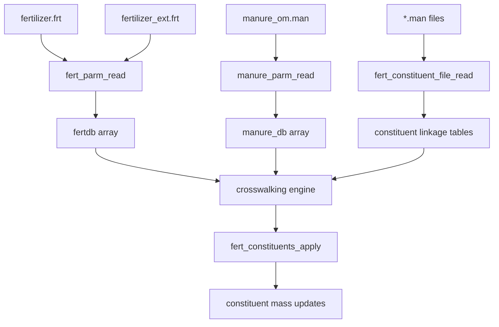

# SWAT+ Fertilizer-Constituent Linking Implementation Guide

## Overview

This technical guide provides detailed implementation specifications for the SWAT+ fertilizer-constituent linking system, focusing on the `fert_ext` mechanism and recent enhancements. The document serves as both a technical reference and implementation guide for developers working with the constituent system.

## Table of Contents

1. [System Architecture](#system-architecture)
2. [File Formats and Data Structures](#file-formats-and-data-structures)
3. [Implementation Details](#implementation-details)

## System Architecture

### 1. Component Overview

The fertilizer-constituent linking system consists of several interconnected components:

```
┌─────────────────────┐    ┌─────────────────────┐    ┌─────────────────────┐
│   Input Files       │    │   Database Layer    │    │   Application Layer │
│                     │    │                     │    │                     │
│ • fertilizer.frt    │───▶│ • fertdb arrays     │───▶│ • cs_fert.f90       │
│ • fertilizer_ext.frt│    │ • manure_db arrays  │    │ • fert_constituents │
│ • manure_om.man     │    │ • linkage tables    │    │ • pl_fert.f90       │
│ • *.man files       │    │ • index maps        │    │ • pl_manure.f90     │
└─────────────────────┘    └─────────────────────┘    └─────────────────────┘
```

### 2. Data Flow Architecture



### 3. Key Design Principles

#### Performance-Oriented Design:
- **Pre-computed Indices**: Database lookups occur during initialization
- **Direct Array Access**: Runtime operations use integer indices, not string matching
- **Memory Locality**: Related data structures are co-located in memory

#### Flexibility and Extensibility:
- **Name-Based Crosswalking**: User-friendly fertilizer-manure linking
- **Modular Constituent Support**: Easy addition of new constituent types
- **Configurable Unit Conversion**: Automatic handling of different unit systems

## File Formats and Data Structures

### 1. Enhanced Fertilizer Format (`fertilizer_ext.frt`)

The extended fertilizer format builds upon the traditional structure:

#### Traditional Format (`fertilizer.frt`):
```
fertilizer.frt: written by SWAT+ editor v2.2.2 on 2023-10-17 14:43 for SWAT+ rev.60.5.4
name           min_n    min_p    org_n    org_p    nh3_n    pathogens  description
elem_n         1.00000  0.00000  0.00000  0.00000  0.00000  null       ElementalNitrogen
urea           0.46000  0.00000  0.00000  0.00000  1.00000  null       Urea
dairy_fresh    0.00500  0.00200  0.01100  0.00400  0.66000  fresh_manure DairyFreshManure
```

#### Extended Format (`fertilizer_ext.frt`):
```
fertilizer_ext.frt: enhanced fertilizer database with manure linkage
name           min_n    min_p    org_n    org_p    nh3_n    om_name              pathogens    description
elem_n         1.00000  0.00000  0.00000  0.00000  0.00000  null                 null         ElementalNitrogen
urea           0.46000  0.00000  0.00000  0.00000  1.00000  null                 null         Urea
dairy_fresh    0.00500  0.00200  0.01100  0.00400  0.66000  dairy_fresh_liquid   fresh_manure DairyFreshManure
beef_solid     0.00600  0.00300  0.02000  0.00800  0.55000  beef_feedlot_solid   fresh_manure BeefFeedlotManure
```

#### Key Enhancement: `om_name` Field
The `om_name` field provides direct linkage to the `manure_om.man` database:
```fortran
type fertilizer_db_extended
  character(len=16) :: fertnm = " "      ! Fertilizer name (traditional)
  real :: fminn, fminp, forgn, forgp, fnh3n  ! NPK composition (traditional)
  character(len=25) :: om_name = " "     ! NEW: Links to manure_om.man
  character(len=16) :: pathogens = " "   ! Pathogen linkage (traditional)
  character(len=256) :: description = " " ! Description (traditional)
  
  ! Runtime-computed fields
  integer :: manure_idx = 0              ! Pre-computed manure database index
  real :: conversion_factor = 0.         ! Unit conversion factor
  logical :: is_manure = .false.         ! Flag indicating manure-based fertilizer
end type fertilizer_db_extended
```

### 2. Manure Organic Matter Database (`manure_om.man`)

#### File Format:
```
manure_om.man: organic matter composition database
name                   region    source   typ        pct_moist pct_solid tot_c  tot_n  inorg_n org_n  tot_p2o5 inorg_p2o5 org_p2o5
dairy_fresh_liquid     midwest   cattle   liquid     92.0      8.0       2.1    0.3    0.15    0.15   0.8      0.4        0.4
beef_feedlot_solid     western   cattle   solid      75.0      25.0      8.5    1.2    0.8     0.4    1.5      0.9        0.6
swine_lagoon_liquid    southeast swine    liquid     95.0      5.0       1.8    0.4    0.25    0.15   1.2      0.7        0.5
poultry_litter_solid   northeast poultry  solid      65.0      35.0      15.2   2.8    1.5     1.3    3.2      2.1        1.1
```

#### Data Structure:
```fortran
type manure_organic_matter_data
  character(len=25) :: name = " "         ! Unique identifier (links to om_name)
  character(len=25) :: region = " "       ! Geographic region
  character(len=25) :: source = " "       ! Animal source
  character(len=25) :: typ = " "          ! Physical form
  
  ! Composition (% by weight)
  real :: pct_moist = 0.0                ! Moisture percentage
  real :: pct_solid = 0.0                ! Solids percentage
  real :: tot_c = 0.0                    ! Total carbon
  real :: tot_n = 0.0                    ! Total nitrogen
  real :: inorg_n = 0.0                  ! Inorganic nitrogen
  real :: org_n = 0.0                    ! Organic nitrogen
  real :: tot_p2o5 = 0.0                 ! Total P2O5
  real :: inorg_p2o5 = 0.0               ! Inorganic P2O5
  real :: org_p2o5 = 0.0                 ! Organic P2O5
  real :: inorg_p = 0.0                  ! Inorganic phosphorus
  real :: org_p = 0.0                    ! Organic phosphorus
  real :: solids = 0.0                   ! Total solids content
  real :: water = 0.0                    ! Water content
end type manure_organic_matter_data
```

### 3. Constituent Linkage Files (`*.man`)

Each constituent type has its own linkage file:

#### Pesticide Linkage (`pest.man`):
```
pest.man: pesticide concentrations in fertilizers (ppm)
NAME                     PPM
dacamine                 1.001
roundup                  3.005
atrazine                 0.850
```

#### Pathogen Linkage (`path.man`):
```
path.man: pathogen concentrations in fertilizers (CFU/g or MPN/g)
NAME                     CFU_G
e_coli                   1000.0
salmonella               500.0
fecal_coliform           2000.0
```

#### Salt Linkage (`salt.man`):
```
salt.man: salt ion concentrations in fertilizers (ppm)
NAME                     PPM
sodium                   250.0
chloride                 180.0
sulfate                  320.0
```

## Implementation Details

### 1. Database Loading and Crosswalking

#### Initialization Sequence:
```fortran
subroutine initialize_fertilizer_constituent_system()
  ! System initialization with error handling
  
  ! 1. Load traditional or extended fertilizer database
  call load_fertilizer_database()
  
  ! 2. Load manure organic matter database  
  call load_manure_database()
  
  ! 3. Load constituent linkage tables
  call load_constituent_linkages()
  
  ! 4. Perform crosswalking and index computation
  call compute_fertilizer_manure_indices()
  
  ! 5. Validate data consistency
  call validate_fertilizer_constituent_data()
  
  ! 6. Build lookup tables for performance
  call build_lookup_tables()
end subroutine
```

#### Fertilizer Database Loading:
```fortran
subroutine load_fertilizer_database()
  logical :: i_exist_ext, i_exist_std
  character(len=80) :: header_line
  integer :: i, num_records
  
  ! Check for extended fertilizer file first
  inquire (file='fertilizer_ext.frt', exist=i_exist_ext)
  inquire (file='fertilizer.frt', exist=i_exist_std)
  
  if (i_exist_ext) then
    call load_extended_fertilizer_format()
    fertilizer_format = 'extended'
  else if (i_exist_std) then
    call load_standard_fertilizer_format()
    fertilizer_format = 'standard'
  else
    call error_exit("No fertilizer database file found (fertilizer.frt or fertilizer_ext.frt)")
  endif
end subroutine

subroutine load_extended_fertilizer_format()
  integer :: i, eof
  character(len=500) :: line
  
  open(unit=107, file='fertilizer_ext.frt', status='old')
  
  ! Skip header lines
  read(107, *) ! Skip comment line
  read(107, *) ! Skip column headers
  
  i = 0
  do
    read(107, '(a)', iostat=eof) line
    if (eof /= 0) exit
    
    i = i + 1
    if (i > mx_ferts) then
      call error_exit("Too many fertilizer records. Increase mx_ferts parameter")
    endif
    
    read(line, *) fertdb(i)%fertnm, fertdb(i)%fminn, fertdb(i)%fminp, &
                  fertdb(i)%forgn, fertdb(i)%forgp, fertdb(i)%fnh3n, &
                  fertdb(i)%om_name, fertdb(i)%pathogens, fertdb(i)%description
    
    ! Clean up names
    fertdb(i)%fertnm = trim(adjustl(fertdb(i)%fertnm))
    fertdb(i)%om_name = trim(adjustl(fertdb(i)%om_name))
  enddo
  
  db_mx%fertparm = i
  close(107)
end subroutine

subroutine load_standard_fertilizer_format()
  integer :: i, eof
  character(len=500) :: line
  
  open(unit=107, file='fertilizer.frt', status='old')
  
  ! Skip header lines
  read(107, *) ! Skip comment line
  read(107, *) ! Skip column headers
  
  i = 0
  do
    read(107, '(a)', iostat=eof) line
    if (eof /= 0) exit
    
    i = i + 1
    if (i > mx_ferts) then
      call error_exit("Too many fertilizer records. Increase mx_ferts parameter")
    endif
    
    read(line, *) fertdb(i)%fertnm, fertdb(i)%fminn, fertdb(i)%fminp, &
                  fertdb(i)%forgn, fertdb(i)%forgp, fertdb(i)%fnh3n, &
                  fertdb(i)%pathogens, fertdb(i)%description
    
    ! Set om_name to null for standard format
    fertdb(i)%om_name = "null"
    fertdb(i)%fertnm = trim(adjustl(fertdb(i)%fertnm))
  enddo
  
  db_mx%fertparm = i
  close(107)
end subroutine
```

#### Manure Database Loading:
```fortran
subroutine load_manure_database()
  logical :: i_exist
  integer :: i, eof
  character(len=500) :: line
  
  inquire(file='manure_om.man', exist=i_exist)
  if (.not. i_exist) then
    db_mx%manureparm = 0
    return
  endif
  
  open(unit=108, file='manure_om.man', status='old')
  
  ! Skip header lines
  read(108, *) ! Skip comment line
  read(108, *) ! Skip column headers
  
  i = 0
  do
    read(108, '(a)', iostat=eof) line
    if (eof /= 0) exit
    
    i = i + 1
    if (i > mx_manure) then
      call error_exit("Too many manure records. Increase mx_manure parameter")
    endif
    
    read(line, *) manure_om_db(i)%name, manure_om_db(i)%region, &
                  manure_om_db(i)%source, manure_om_db(i)%typ, &
                  manure_om_db(i)%pct_moist, manure_om_db(i)%pct_solid, &
                  manure_om_db(i)%tot_c, manure_om_db(i)%tot_n, &
                  manure_om_db(i)%inorg_n, manure_om_db(i)%org_n, &
                  manure_om_db(i)%tot_p2o5, manure_om_db(i)%inorg_p2o5, &
                  manure_om_db(i)%org_p2o5
    
    ! Clean up names and calculate derived properties
    manure_om_db(i)%name = trim(adjustl(manure_om_db(i)%name))
    manure_om_db(i)%typ = trim(adjustl(manure_om_db(i)%typ))
    
    ! Calculate derived phosphorus values (P2O5 to P conversion: factor 0.436)
    manure_om_db(i)%inorg_p = manure_om_db(i)%inorg_p2o5 * 0.436
    manure_om_db(i)%org_p = manure_om_db(i)%org_p2o5 * 0.436
    
    ! Calculate total solids and water content
    manure_om_db(i)%solids = manure_om_db(i)%pct_solid
    manure_om_db(i)%water = manure_om_db(i)%pct_moist
  enddo
  
  db_mx%manureparm = i
  close(108)
end subroutine
```

#### Constituent Linkage Loading:
```fortran
subroutine load_constituent_linkages()
  ! Load different types of constituent linkage files using existing routine
  call load_pesticide_linkages()
  call load_pathogen_linkages()
  call load_salt_linkages()
  call load_heavy_metal_linkages()
end subroutine

subroutine load_pesticide_linkages()
  logical :: i_exist
  integer :: i, j
  
  inquire(file='pest.man', exist=i_exist)
  if (.not. i_exist) then
    return
  endif
  
  ! Use existing fert_constituent_file_read routine
  call fert_constituent_file_read('pest.man', cs_db%num_pests)
  
  ! Map loaded data to pesticide arrays
  if (allocated(fert_arr)) then
    do i = 1, cs_db%num_pests
      do j = 1, db_mx%fertparm
        if (fertdb(j)%is_manure) then
          ! Find matching pesticide and fertilizer
          pest_fert_ini(i)%conc(j) = get_constituent_concentration('pest', i, j)
        endif
      enddo
    enddo
  endif
end subroutine

subroutine load_pathogen_linkages()
  logical :: i_exist
  integer :: i, j
  
  inquire(file='path.man', exist=i_exist)
  if (.not. i_exist) then
    return
  endif
  
  ! Use existing fert_constituent_file_read routine
  call fert_constituent_file_read('path.man', cs_db%num_paths)
  
  ! Map loaded data to pathogen arrays
  if (allocated(fert_arr)) then
    do i = 1, cs_db%num_paths
      do j = 1, db_mx%fertparm
        if (fertdb(j)%is_manure) then
          path_fert_ini(i)%conc(j) = get_constituent_concentration('path', i, j)
        endif
      enddo
    enddo
  endif
end subroutine

subroutine load_salt_linkages()
  logical :: i_exist
  integer :: i, j
  
  inquire(file='salt.man', exist=i_exist)
  if (.not. i_exist) then
    return
  endif
  
  ! Use existing fert_constituent_file_read routine
  call fert_constituent_file_read('salt.man', cs_db%num_salts)
  
  ! Map loaded data to salt arrays
  if (allocated(fert_arr)) then
    do i = 1, cs_db%num_salts
      do j = 1, db_mx%fertparm
        if (fertdb(j)%is_manure) then
          salt_fert_ini(i)%conc(j) = get_constituent_concentration('salt', i, j)
        endif
      enddo
    enddo
  endif
end subroutine

subroutine load_heavy_metal_linkages()
  logical :: i_exist
  integer :: i, j
  
  inquire(file='hmet.man', exist=i_exist)
  if (.not. i_exist) then
    return
  endif
  
  ! Use existing fert_constituent_file_read routine
  call fert_constituent_file_read('hmet.man', cs_db%num_hmets)
  
  ! Map loaded data to heavy metal arrays
  if (allocated(fert_arr)) then
    do i = 1, cs_db%num_hmets
      do j = 1, db_mx%fertparm
        if (fertdb(j)%is_manure) then
          hmet_fert_ini(i)%conc(j) = get_constituent_concentration('hmet', i, j)
        endif
      enddo
    enddo
  endif
end subroutine

function get_constituent_concentration(const_type, const_idx, fert_idx) result(concentration)
  character(len=*), intent(in) :: const_type
  integer, intent(in) :: const_idx, fert_idx
  real :: concentration
  
  integer :: i
  
  concentration = 0.0
  
  ! Find matching constituent and fertilizer in fert_arr
  do i = 1, size(fert_arr)
    if (trim(fert_arr(i)%name) == trim(fertdb(fert_idx)%fertnm)) then
      if (const_idx <= size(fert_arr(i)%ppm)) then
        concentration = fert_arr(i)%ppm(const_idx)
      endif
      exit
    endif
  enddo
end function
```

#### Crosswalking Implementation:
```fortran
subroutine compute_fertilizer_manure_indices()
  integer :: i, j
  integer :: matched_count = 0
  
  do i = 1, db_mx%fertparm
    ! Initialize values
    fertdb(i)%manure_idx = 0
    fertdb(i)%is_manure = .false.
    fertdb(i)%conversion_factor = 0.0
    
    if (trim(fertdb(i)%om_name) /= "" .and. trim(fertdb(i)%om_name) /= "null") then
      ! Find matching manure record
      do j = 1, db_mx%manureparm
        if (trim(fertdb(i)%om_name) == trim(manure_om_db(j)%name)) then
          ! Store pre-computed index
          fertdb(i)%manure_idx = j
          fertdb(i)%is_manure = .true.
          matched_count = matched_count + 1
          
          ! Set unit conversion factor
          call set_conversion_factor(fertdb(i), manure_om_db(j))
          exit
        endif
      enddo
    endif
  enddo
end subroutine
```

### 2. Unit Conversion System

#### Conversion Factor Calculation:
```fortran
subroutine set_conversion_factor(fert_rec, manure_rec)
  type(fertilizer_db_extended), intent(inout) :: fert_rec
  type(manure_organic_matter_data), intent(in) :: manure_rec
  
  select case (trim(manure_rec%typ))
    case ('liquid')
      ! 1 lb/1000 gal = 119.82 ppm (liquid manure density ~8.34 lb/gal)
      fert_rec%conversion_factor = 119.82
      
    case ('slurry')
      ! Intermediate density, use liquid conversion
      fert_rec%conversion_factor = 119.82
      
    case ('solid', 'semi-solid')
      ! 1 lb/ton = 500 ppm (2000 lb/ton conversion)
      fert_rec%conversion_factor = 500.0
      
    case ('compost')
      ! Composted material, use solid conversion
      fert_rec%conversion_factor = 500.0
      
    case default
      ! Default to solid conversion
      fert_rec%conversion_factor = 500.0
  end select
end subroutine
```

#### Runtime Unit Conversion:
```fortran
function convert_constituent_loading(base_rate_kg_ha, conc_ppm, conversion_factor) result(loading_kg_ha)
  real, intent(in) :: base_rate_kg_ha      ! Fertilizer application rate
  real, intent(in) :: conc_ppm             ! Constituent concentration
  real, intent(in) :: conversion_factor    ! Unit conversion factor
  real :: loading_kg_ha                    ! Resulting constituent loading
  
  ! Convert ppm to kg/kg, then multiply by application rate
  ! Formula: loading = rate * concentration * conversion / 1,000,000
  loading_kg_ha = base_rate_kg_ha * conc_ppm * conversion_factor / 1.0e6
  
  ! Apply minimum threshold to avoid numerical issues
  if (loading_kg_ha < 1.0e-12) loading_kg_ha = 0.0
end function

function convert_pathogen_loading(base_rate_kg_ha, cfu_per_g, conversion_factor) result(loading_cfu_ha)
  real, intent(in) :: base_rate_kg_ha      ! Fertilizer application rate
  real, intent(in) :: cfu_per_g            ! Pathogen concentration (CFU/g)
  real, intent(in) :: conversion_factor    ! Unit conversion factor
  real :: loading_cfu_ha                   ! Resulting pathogen loading (CFU/ha)
  
  ! Convert CFU/g to CFU/ha based on application rate
  ! 1 kg = 1000 g, so multiply by 1000
  loading_cfu_ha = base_rate_kg_ha * cfu_per_g * 1000.0
  
  ! Apply minimum threshold
  if (loading_cfu_ha < 1.0) loading_cfu_ha = 0.0
end function
```

### 3. Constituent Application Engine

#### Master Application Routine:
```fortran
subroutine fert_constituents_apply(j, ifrt, frt_kg, fertop)
  integer, intent(in) :: j           ! HRU number
  integer, intent(in) :: ifrt        ! Fertilizer ID
  real, intent(in) :: frt_kg         ! Application rate (kg/ha)
  integer, intent(in) :: fertop      ! Application method
  
  ! Input validation
  if (j <= 0 .or. j > nhru) return
  if (ifrt <= 0 .or. ifrt > db_mx%fertparm) return
  if (frt_kg <= 0.0) return
  
  ! Only apply constituents for manure-based fertilizers
  if (.not. fertdb(ifrt)%is_manure) return
  
  ! Check if constituent tracking is enabled
  if (.not. cs_db%constituents_active) return
  
  ! Apply each constituent type if enabled
  if (cs_db%pest_active) call apply_pesticide_constituents(j, ifrt, frt_kg, fertop)
  if (cs_db%path_active) call apply_pathogen_constituents(j, ifrt, frt_kg, fertop)
  if (cs_db%salt_active) call apply_salt_constituents(j, ifrt, frt_kg, fertop)
  if (cs_db%hmet_active) call apply_heavy_metal_constituents(j, ifrt, frt_kg, fertop)
  
  ! Update daily application tracking
  hru_fert_const(j)%daily_applications = hru_fert_const(j)%daily_applications + 1
  hru_fert_const(j)%total_fert_applied = hru_fert_const(j)%total_fert_applied + frt_kg
end subroutine
```

#### Pesticide Application Implementation:
```fortran
subroutine apply_pesticide_constituents(j, ifrt, frt_kg, fertop)
  integer, intent(in) :: j, ifrt, fertop
  real, intent(in) :: frt_kg
  
  integer :: ipest, soil_layer
  real :: pest_loading_kg_ha, surface_fraction, subsurface_fraction
  real :: layer_thickness_ratio
  
  if (cs_db%num_pests == 0) return
  if (.not. allocated(pest_fert_ini)) return
  
  ! Get application method parameters
  if (fertop > 0 .and. fertop <= db_mx%chemapp) then
    surface_fraction = chemapp_db(fertop)%surf_frac
  else
    surface_fraction = 0.7  ! Default: 70% surface application
  endif
  subsurface_fraction = 1.0 - surface_fraction
  
  ! Apply each pesticide
  do ipest = 1, cs_db%num_pests
    if (pest_fert_ini(ipest)%conc(ifrt) > 0.0) then
      ! Calculate pesticide loading (kg/ha)
      pest_loading_kg_ha = convert_constituent_loading(frt_kg, &
                           pest_fert_ini(ipest)%conc(ifrt), &
                           fertdb(ifrt)%conversion_factor)
      
      ! Apply to soil layers based on application method
      do soil_layer = 1, min(soil(j)%nly, 3)  ! Apply to top 3 layers max
        select case (soil_layer)
          case (1)
            ! Surface layer gets majority of application
            pest_mass_layer = pest_loading_kg_ha * surface_fraction
            
          case (2)
            ! Second layer gets subsurface fraction
            pest_mass_layer = pest_loading_kg_ha * subsurface_fraction * 0.8
            
          case (3)
            ! Third layer gets remaining subsurface fraction
            pest_mass_layer = pest_loading_kg_ha * subsurface_fraction * 0.2
            
          case default
            pest_mass_layer = 0.0
        end select
        
        ! Update soil pesticide mass
        hru_pest_soil(j)%pest(ipest)%soil(soil_layer) = &
          hru_pest_soil(j)%pest(ipest)%soil(soil_layer) + pest_mass_layer
        
        ! Update daily balance arrays
        hpestb_d(j)%pest(ipest)%fert = hpestb_d(j)%pest(ipest)%fert + pest_mass_layer
        
        ! Update annual balance arrays
        hpestb_a(j)%pest(ipest)%fert = hpestb_a(j)%pest(ipest)%fert + pest_mass_layer
      enddo
      
      ! Track total pesticide applied for this HRU
      hru_pest_soil(j)%pest(ipest)%tot_fert = &
        hru_pest_soil(j)%pest(ipest)%tot_fert + pest_loading_kg_ha
    endif
  enddo
end subroutine
```

#### Pathogen Application Implementation:
```fortran
subroutine apply_pathogen_constituents(j, ifrt, frt_kg, fertop)
  integer, intent(in) :: j, ifrt, fertop
  real, intent(in) :: frt_kg
  
  integer :: ipath, soil_layer
  real :: path_loading_cfu_ha, surface_fraction
  real :: survival_factor, temperature_factor
  
  if (cs_db%num_paths == 0) return
  if (.not. allocated(path_fert_ini)) return
  
  ! Get application method parameters
  if (fertop > 0 .and. fertop <= db_mx%chemapp) then
    surface_fraction = chemapp_db(fertop)%surf_frac
  else
    surface_fraction = 0.9  ! Default: 90% surface for pathogens
  endif
  
  ! Calculate environmental survival factors
  call calculate_pathogen_survival_factors(j, survival_factor, temperature_factor)
  
  ! Apply each pathogen
  do ipath = 1, cs_db%num_paths
    if (path_fert_ini(ipath)%conc(ifrt) > 0.0) then
      ! Calculate pathogen loading (CFU/ha)
      path_loading_cfu_ha = convert_pathogen_loading(frt_kg, &
                            path_fert_ini(ipath)%conc(ifrt), &
                            fertdb(ifrt)%conversion_factor)
      
      ! Apply survival factors
      path_loading_cfu_ha = path_loading_cfu_ha * survival_factor * temperature_factor
      
      ! Apply to soil layers (pathogens mainly stay in surface layers)
      do soil_layer = 1, min(soil(j)%nly, 2)  ! Apply to top 2 layers only
        select case (soil_layer)
          case (1)
            ! Surface layer gets majority of pathogens
            path_mass_layer = path_loading_cfu_ha * surface_fraction
            
          case (2)
            ! Second layer gets remaining fraction
            path_mass_layer = path_loading_cfu_ha * (1.0 - surface_fraction)
            
          case default
            path_mass_layer = 0.0
        end select
        
        ! Update soil pathogen count
        hru_path_soil(j)%path(ipath)%soil(soil_layer) = &
          hru_path_soil(j)%path(ipath)%soil(soil_layer) + path_mass_layer
        
        ! Update balance arrays
        hpathb_d(j)%path(ipath)%fert = hpathb_d(j)%path(ipath)%fert + path_mass_layer
        hpathb_a(j)%path(ipath)%fert = hpathb_a(j)%path(ipath)%fert + path_mass_layer
      enddo
      
      ! Track total pathogen loading
      hru_path_soil(j)%path(ipath)%tot_fert = &
        hru_path_soil(j)%path(ipath)%tot_fert + path_loading_cfu_ha
    endif
  enddo
end subroutine

subroutine calculate_pathogen_survival_factors(j, survival_factor, temperature_factor)
  integer, intent(in) :: j
  real, intent(out) :: survival_factor, temperature_factor
  
  real :: soil_temp, soil_moisture, ph_factor
  
  ! Get current environmental conditions
  soil_temp = soil(j)%phys(1)%tmp
  soil_moisture = soil(j)%phys(1)%wc / soil(j)%phys(1)%fc
  
  ! Temperature survival factor (pathogens survive better in cooler conditions)
  if (soil_temp < 5.0) then
    temperature_factor = 0.9  ! High survival in cold
  else if (soil_temp < 15.0) then
    temperature_factor = 0.7  ! Medium survival in cool
  else if (soil_temp < 25.0) then
    temperature_factor = 0.4  ! Lower survival in warm
  else
    temperature_factor = 0.1  ! Low survival in hot
  endif
  
  ! Moisture survival factor (pathogens need moisture)
  if (soil_moisture > 0.8) then
    survival_factor = 0.8  ! High survival when very moist
  else if (soil_moisture > 0.4) then
    survival_factor = 0.6  ! Medium survival when moderately moist
  else if (soil_moisture > 0.1) then
    survival_factor = 0.3  ! Lower survival when dry
  else
    survival_factor = 0.05  ! Very low survival when very dry
  endif
end subroutine
```

#### Salt Application Implementation:
```fortran
subroutine apply_salt_constituents(j, ifrt, frt_kg, fertop)
  integer, intent(in) :: j, ifrt, fertop
  real, intent(in) :: frt_kg
  
  integer :: isalt, soil_layer
  real :: salt_loading_kg_ha, distribution_fraction
  real :: leaching_factor
  
  if (cs_db%num_salts == 0) return
  if (.not. allocated(salt_fert_ini)) return
  
  ! Calculate leaching factor based on soil properties
  call calculate_salt_leaching_factor(j, leaching_factor)
  
  ! Apply each salt constituent
  do isalt = 1, cs_db%num_salts
    if (salt_fert_ini(isalt)%conc(ifrt) > 0.0) then
      ! Calculate salt loading (kg/ha)
      salt_loading_kg_ha = convert_constituent_loading(frt_kg, &
                           salt_fert_ini(isalt)%conc(ifrt), &
                           fertdb(ifrt)%conversion_factor)
      
      ! Distribute salts through soil profile (salts are mobile)
      do soil_layer = 1, min(soil(j)%nly, 5)  ! Apply to top 5 layers
        ! Distribution decreases with depth but salts can leach
        distribution_fraction = exp(-0.5 * real(soil_layer - 1)) * leaching_factor
        
        salt_mass_layer = salt_loading_kg_ha * distribution_fraction
        
        ! Update soil salt concentration
        hru_salt_soil(j)%salt(isalt)%soil(soil_layer) = &
          hru_salt_soil(j)%salt(isalt)%soil(soil_layer) + salt_mass_layer
        
        ! Update balance arrays
        hsaltb_d(j)%salt(isalt)%fert = hsaltb_d(j)%salt(isalt)%fert + salt_mass_layer
        hsaltb_a(j)%salt(isalt)%fert = hsaltb_a(j)%salt(isalt)%fert + salt_mass_layer
      enddo
      
      ! Track total salt loading
      hru_salt_soil(j)%salt(isalt)%tot_fert = &
        hru_salt_soil(j)%salt(isalt)%tot_fert + salt_loading_kg_ha
    endif
  enddo
end subroutine

subroutine calculate_salt_leaching_factor(j, leaching_factor)
  integer, intent(in) :: j
  real, intent(out) :: leaching_factor
  
  real :: soil_permeability, drainage_factor
  
  ! Get soil hydraulic properties
  soil_permeability = soil(j)%phys(1)%k
  
  ! Calculate leaching potential based on permeability
  if (soil_permeability > 50.0) then
    leaching_factor = 1.5  ! High leaching in sandy soils
  else if (soil_permeability > 10.0) then
    leaching_factor = 1.0  ! Normal leaching in loamy soils
  else if (soil_permeability > 1.0) then
    leaching_factor = 0.7  ! Reduced leaching in clay soils
  else
    leaching_factor = 0.3  ! Minimal leaching in tight soils
  endif
end subroutine
```

#### Heavy Metal Application Implementation:
```fortran
subroutine apply_heavy_metal_constituents(j, ifrt, frt_kg, fertop)
  integer, intent(in) :: j, ifrt, fertop
  real, intent(in) :: frt_kg
  
  integer :: ihmet, soil_layer
  real :: hmet_loading_kg_ha, sorption_factor
  real :: ph_factor, organic_matter_factor
  
  if (cs_db%num_hmets == 0) return
  if (.not. allocated(hmet_fert_ini)) return
  
  ! Calculate sorption factors based on soil properties
  call calculate_heavy_metal_sorption(j, sorption_factor, ph_factor, organic_matter_factor)
  
  ! Apply each heavy metal constituent
  do ihmet = 1, cs_db%num_hmets
    if (hmet_fert_ini(ihmet)%conc(ifrt) > 0.0) then
      ! Calculate heavy metal loading (kg/ha)
      hmet_loading_kg_ha = convert_constituent_loading(frt_kg, &
                           hmet_fert_ini(ihmet)%conc(ifrt), &
                           fertdb(ifrt)%conversion_factor)
      
      ! Apply sorption factors (heavy metals bind strongly to soil)
      hmet_loading_kg_ha = hmet_loading_kg_ha * sorption_factor * ph_factor * organic_matter_factor
      
      ! Heavy metals accumulate primarily in surface layers
      do soil_layer = 1, min(soil(j)%nly, 3)  ! Apply to top 3 layers
        select case (soil_layer)
          case (1)
            ! Surface layer gets most heavy metals (80%)
            hmet_mass_layer = hmet_loading_kg_ha * 0.8
            
          case (2)
            ! Second layer gets some (15%)
            hmet_mass_layer = hmet_loading_kg_ha * 0.15
            
          case (3)
            ! Third layer gets minimal (5%)
            hmet_mass_layer = hmet_loading_kg_ha * 0.05
            
          case default
            hmet_mass_layer = 0.0
        end select
        
        ! Update soil heavy metal concentration
        hru_hmet_soil(j)%hmet(ihmet)%soil(soil_layer) = &
          hru_hmet_soil(j)%hmet(ihmet)%soil(soil_layer) + hmet_mass_layer
        
        ! Update balance arrays
        hhmetb_d(j)%hmet(ihmet)%fert = hhmetb_d(j)%hmet(ihmet)%fert + hmet_mass_layer
        hhmetb_a(j)%hmet(ihmet)%fert = hhmetb_a(j)%hmet(ihmet)%fert + hmet_mass_layer
      enddo
      
      ! Track total heavy metal loading
      hru_hmet_soil(j)%hmet(ihmet)%tot_fert = &
        hru_hmet_soil(j)%hmet(ihmet)%tot_fert + hmet_loading_kg_ha
    endif
  enddo
end subroutine

subroutine calculate_heavy_metal_sorption(j, sorption_factor, ph_factor, organic_matter_factor)
  integer, intent(in) :: j
  real, intent(out) :: sorption_factor, ph_factor, organic_matter_factor
  
  real :: soil_ph, organic_carbon_pct, clay_content
  
  ! Get soil chemical and physical properties
  soil_ph = soil(j)%ly(1)%ph
  organic_carbon_pct = soil(j)%ly(1)%carbon * 100.0
  clay_content = soil(j)%ly(1)%clay
  
  ! pH factor (higher pH increases sorption)
  if (soil_ph > 7.5) then
    ph_factor = 1.2  ! High sorption in alkaline soils
  else if (soil_ph > 6.5) then
    ph_factor = 1.0  ! Normal sorption in neutral soils
  else if (soil_ph > 5.5) then
    ph_factor = 0.8  ! Reduced sorption in slightly acid soils
  else
    ph_factor = 0.5  ! Low sorption in acid soils
  endif
  
  ! Organic matter factor (more OM increases sorption)
  if (organic_carbon_pct > 3.0) then
    organic_matter_factor = 1.3  ! High sorption with high OM
  else if (organic_carbon_pct > 1.5) then
    organic_matter_factor = 1.0  ! Normal sorption with medium OM
  else if (organic_carbon_pct > 0.5) then
    organic_matter_factor = 0.8  ! Reduced sorption with low OM
  else
    organic_matter_factor = 0.6  ! Low sorption with very low OM
  endif
  
  ! Base sorption factor from clay content
  if (clay_content > 40.0) then
    sorption_factor = 1.2  ! High sorption in clay soils
  else if (clay_content > 20.0) then
    sorption_factor = 1.0  ! Normal sorption in loamy soils
  else
    sorption_factor = 0.7  ! Lower sorption in sandy soils
  endif
end subroutine
```

### 4. Performance Optimizations

#### Index Caching:
```fortran
! Global arrays for fast lookup
integer, dimension(:), allocatable :: fertilizer_to_manure_map
logical, dimension(:), allocatable :: fertilizer_is_manure
real, dimension(:), allocatable :: fertilizer_conversion_factors

subroutine build_lookup_tables()
  integer :: i
  
  ! Allocate lookup arrays
  allocate(fertilizer_to_manure_map(db_mx%fertparm))
  allocate(fertilizer_is_manure(db_mx%fertparm))
  allocate(fertilizer_conversion_factors(db_mx%fertparm))
  
  ! Populate lookup arrays for fast runtime access
  do i = 1, db_mx%fertparm
    fertilizer_to_manure_map(i) = fertdb(i)%manure_idx
    fertilizer_is_manure(i) = fertdb(i)%is_manure
    fertilizer_conversion_factors(i) = fertdb(i)%conversion_factor
  enddo
end subroutine

subroutine cleanup_lookup_tables()
  ! Deallocate lookup arrays when done
  if (allocated(fertilizer_to_manure_map)) deallocate(fertilizer_to_manure_map)
  if (allocated(fertilizer_is_manure)) deallocate(fertilizer_is_manure)
  if (allocated(fertilizer_conversion_factors)) deallocate(fertilizer_conversion_factors)
end subroutine
```

#### Memory Layout Optimization:
```fortran
! Structure-of-arrays for better cache performance
type constituent_arrays
  real, dimension(:,:), allocatable :: concentrations  ! (fertilizer, constituent)
  integer, dimension(:), allocatable :: fertilizer_ids
  integer, dimension(:), allocatable :: constituent_ids
end type constituent_arrays

type(constituent_arrays) :: pest_data, path_data, salt_data, hmet_data, cs_data
```

---

*Document Version: 1.0*  
*Last Updated: August 2024*  
*Authors: SWAT+ Development Team*  
*Focus: Technical Implementation*