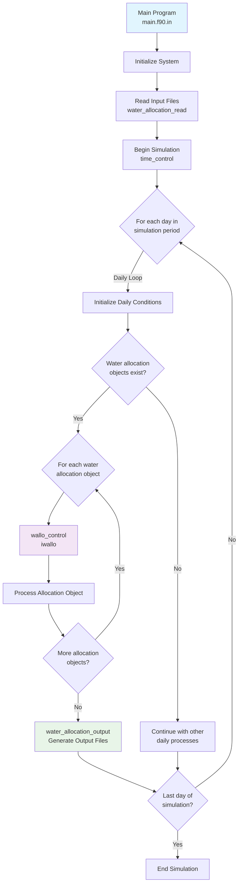
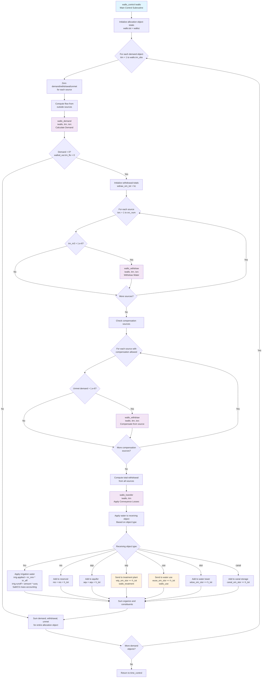
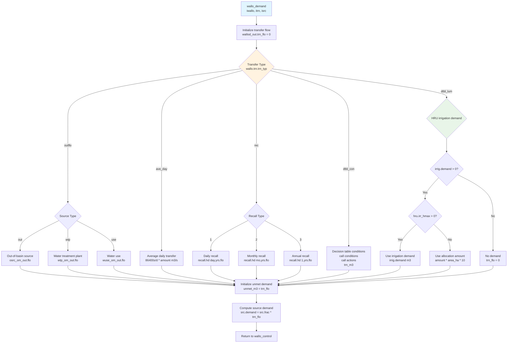
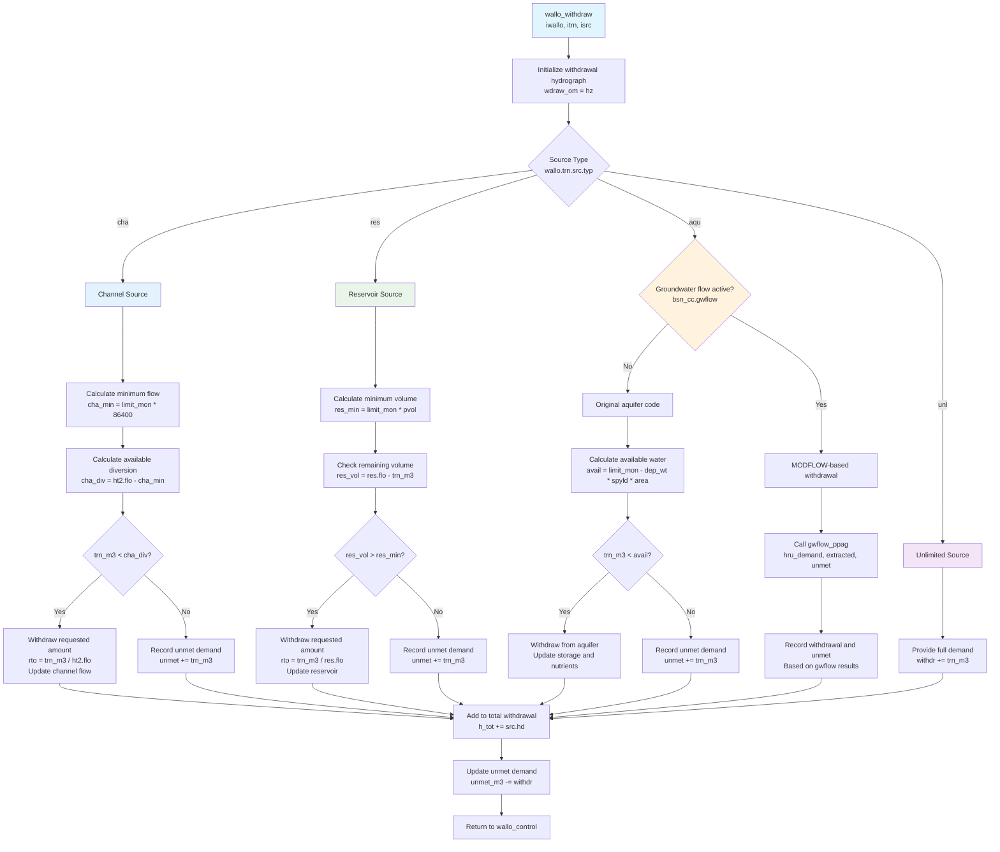
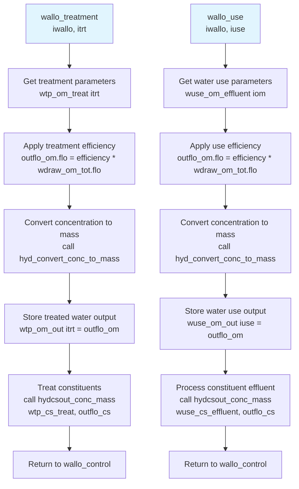
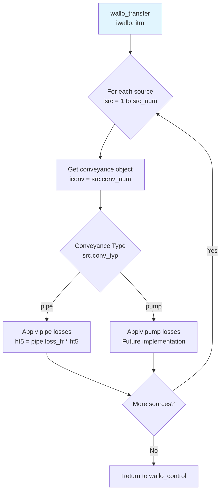
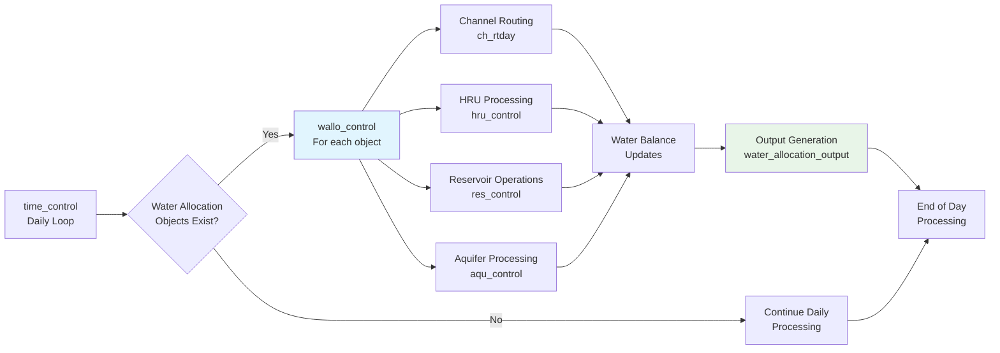

# SWAT+ Water Allocation System Flowchart

This document contains flowchart diagrams showing the program flow of the SWAT+ water allocation system.

## Overall System Flowchart

## Detailed Water Allocation Control Flow

## Water Demand Calculation Flow

## Water Withdrawal Flow

## Water Treatment Flow

## Water Transfer Flow

## Integration with Main SWAT+ Components

These flowcharts provide a comprehensive visual representation of the SWAT+ water allocation system's program flow, showing the relationships between subroutines and the decision logic within each component.