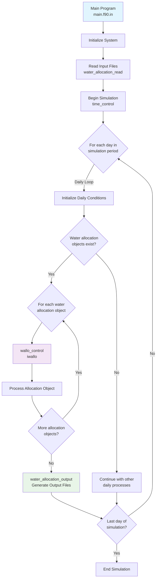
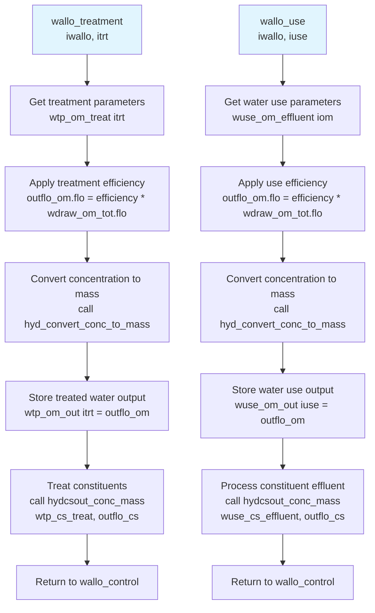
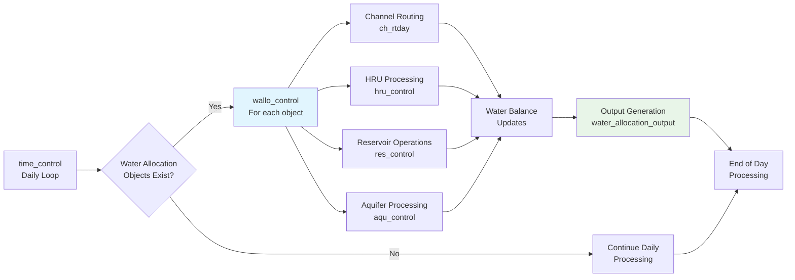

# SWAT+ Water Allocation System Flowchart

This document contains flowchart diagrams showing the program flow of the SWAT+ water allocation system.

## Overall System Flowchart



## Detailed Water Allocation Control Flow

```mermaid
flowchart TD
    A[wallo_control iwallo<br/>Main Control Subroutine] --> B[Initialize allocation object totals<br/>wallo.tot = walloz]
    
    B --> C{For each transfer object<br/>itrn = 1 to wallo.trn_obs}
    
    C --> D[Zero demand/withdrawal/unmet<br/>for each source<br/>wallod_out.trn.src = walloz]
    D --> E[Compute flow from outside sources<br/>Loop: iosrc = 1 to wallo.out_src]
    E --> E1{Outside source limit type<br/>wallo.osrc.lim_typ}
    E1 -->|mon_lim| E2[Monthly limit<br/>osrc_om_out.flo = limit_mon.mo]
    E1 -->|dtbl| E3[Decision table<br/>Future implementation]
    E1 -->|recall| E4[Recall file<br/>Future implementation]
    
    E2 --> F[wallo_demand<br/>iwallo, itrn, isrc<br/>Calculate Transfer Demand]
    E3 --> F
    E4 --> F
    
    F --> G{Transfer demand > 0?<br/>wallod_out.trn_flo > 0}
    
    G -->|Yes| H[Initialize withdrawal totals<br/>wdraw_om_tot = hz]
    G -->|No| W[Sum totals for<br/>allocation object]
    
    H --> I{For each source<br/>isrc = 1 to wallo.trn.src_num}
    I --> J{trn_m3 > 1.e-6?<br/>wallod_out.trn.src.demand}
    J -->|Yes| K[wallo_withdraw<br/>iwallo, itrn, isrc<br/>Withdraw Water from Source]
    J -->|No| L{More sources?}
    
    K --> L
    L -->|Yes| I
    L -->|No| M[Check compensation sources<br/>Loop through sources again]
    
    M --> N{For each source with<br/>compensation allowed<br/>wallo.trn.src.comp = "y"}
    N --> O{Unmet demand > 1.e-6?<br/>wallo.trn.unmet_m3}
    O -->|Yes| P[wallo_withdraw<br/>iwallo, itrn, isrc<br/>Compensate from source]
    O -->|No| Q{More compensation<br/>sources?}
    
    P --> Q
    Q -->|Yes| N
    Q -->|No| R[Compute total withdrawal<br/>wallo.trn.withdr_tot from all sources]
    
    R --> S[wallo_transfer<br/>iwallo, itrn<br/>Apply Conveyance Losses]
    
    S --> T[Apply water to receiving object<br/>Based on wallo.trn.rcv.typ]
    T --> U{Receiving object type<br/>wallo.trn.rcv.typ}
    
    U -->|hru| U1[Apply irrigation water<br/>j = wallo.trn.rcv.num<br/>irrig.applied = irr_mm * irr_eff<br/>irrig.runoff = amount * surq<br/>Salt/CS mass accounting]
    U -->|res| U2[Add to reservoir<br/>j = wallo.trn.rcv.num<br/>res = res + wal_om.trn.h_tot]
    U -->|aqu| U3[Add to aquifer<br/>j = wallo.trn.rcv.num<br/>aqu = aqu + wal_om.trn.h_tot]
    U -->|wtp| U4[Send to treatment plant<br/>wtp_om_stor += wal_om.trn.h_tot<br/>wallo_treatment]
    U -->|use| U5[Send to water use<br/>wuse_om_stor += wal_om.trn.h_tot<br/>wallo_use]
    U -->|stor| U6[Add to water tower<br/>wtow_om_stor += wal_om.trn.h_tot]
    U -->|canal| U7[Add to canal storage<br/>canal_om_stor += wal_om.trn.h_tot]
    
    U1 --> V[Sum organics and constituents<br/>wdraw_om_tot += wdraw_om]
    U2 --> V
    U3 --> V
    U4 --> V
    U5 --> V
    U6 --> V
    U7 --> V
    
    V --> W[Sum totals for allocation object<br/>wallo.tot.demand += wallod_out.trn_flo<br/>wallo.tot.withdr += wallo.trn.withdr_tot<br/>wallo.tot.unmet += wallo.trn.unmet_m3]
    W --> X{More transfer<br/>objects?}
    X -->|Yes| C
    X -->|No| Y[Return to time_control]

    style A fill:#e1f5fe
    style F fill:#f3e5f5
    style K fill:#f3e5f5
    style P fill:#f3e5f5
    style S fill:#f3e5f5
    style U4 fill:#fff3e0
    style U5 fill:#fff3e0
```

## Water Transfer Demand Calculation Flow

```mermaid
flowchart TD
    A[wallo_demand<br/>iwallo, itrn, isrc] --> B[Initialize transfer flow<br/>wallod_out.trn.trn_flo = 0<br/>trans_m3 = 0]
    
    B --> C{Transfer Type<br/>wallo.trn.trn_typ}
    
    C -->|outflo| D{Outside Source Type<br/>wallo.trn.trn_typ}
    D -->|out| D1[Out-of-basin source<br/>wallod_out.trn.trn_flo = osrc_om_out.flo]
    D -->|wtp| D2[Water treatment plant<br/>wallod_out.trn.trn_flo = wtp_om_out.flo]  
    D -->|use| D3[Water use<br/>wallod_out.trn.trn_flo = wuse_om_out.flo]
    
    C -->|ave_day| E[Average daily transfer<br/>wallod_out.trn.trn_flo = 86400 * wallo.trn.amount]
    
    C -->|rec| F{Recall Type<br/>recall.typ}
    F -->|1| F1[Daily recall<br/>wallod_out.trn.trn_flo = recall.hd[day,yrs].flo]
    F -->|2| F2[Monthly recall<br/>wallod_out.trn.trn_flo = recall.hd[mo,yrs].flo]
    F -->|3| F3[Annual recall<br/>wallod_out.trn.trn_flo = recall.hd[1,yrs].flo]
    
    C -->|dtbl_con| G[Decision table conditions<br/>id = wallo.trn.rec_num<br/>call conditions<br/>call actions<br/>wallod_out.trn.trn_flo = trn_m3]
    
    C -->|dtbl_lum| H{HRU irrigation transfer<br/>j = wallo.trn.num}
    H --> H1{irrig.demand > 0?}
    H1 -->|Yes| H2{hru.irr_hmax > 0?}
    H2 -->|Yes| H3[Use irrigation demand<br/>wallod_out.trn.trn_flo = irrig.demand]
    H2 -->|No| H4[Use allocation amount<br/>wallod_out.trn.trn_flo = wallo.trn.amount * hru.area_ha * 10]
    H1 -->|No| H5[No transfer demand<br/>wallod_out.trn.trn_flo = 0]
    
    D1 --> I[Initialize unmet transfer<br/>wallo.trn.unmet_m3 = wallod_out.trn.trn_flo]
    D2 --> I
    D3 --> I
    E --> I
    F1 --> I
    F2 --> I
    F3 --> I
    G --> I
    H3 --> I
    H4 --> I
    H5 --> I
    
    I --> J[Compute source demand<br/>wallod_out.trn.src.demand = wallo.trn.src.frac * wallod_out.trn.trn_flo]
    J --> K[Return to wallo_control]

    style A fill:#e1f5fe
    style C fill:#fff3e0
    style H fill:#e8f5e8
```

## Water Withdrawal Flow

```mermaid
flowchart TD
    A[wallo_withdraw<br/>iwallo, itrn, isrc] --> B[Initialize withdrawal hydrograph<br/>wdraw_om = hz]
    
    B --> C{Source Type<br/>wallo.trn.src.typ}
    
    C -->|cha| D[Channel Source]
    D --> D1[Get source water allocation object<br/>isrc_wallo = wallo.trn.src_wal[isrc]]
    D1 --> D2[Calculate minimum flow<br/>cha_min = wallo.osrc[isrc_wallo].limit_mon[time.mo] * 86400]
    D2 --> D3[Calculate available diversion<br/>cha_div = ht2.flo - cha_min]
    D3 --> D4{trn_m3 < cha_div?}
    D4 -->|Yes| D5[Withdraw requested amount<br/>rto = trn_m3 / ht2.flo<br/>wal_om.trn.src.hd = rto * ht2<br/>ht2 = (1 - rto) * ht2<br/>wallod_out.trn.src.withdr += trn_m3]
    D4 -->|No| D6[Record unmet demand<br/>wallod_out.trn.src.unmet += trn_m3]
    
    C -->|res| E[Reservoir Source]
    E --> E1[Get source water allocation object<br/>isrc_wallo = wallo.trn.src_wal[isrc]]
    E1 --> E2[Calculate minimum volume<br/>res_min = wallo.osrc[isrc_wallo].limit_mon[time.mo] * res_ob.pvol]
    E2 --> E3[Check remaining volume<br/>res_vol = res.flo - trn_m3]
    E3 --> E4{res_vol > res_min?}
    E4 -->|Yes| E5[Withdraw requested amount<br/>rto = trn_m3 / res.flo<br/>wal_om.trn.src.hd = rto * res<br/>res = (1 - rto) * res<br/>wallod_out.trn.src.withdr += trn_m3]
    E4 -->|No| E6[Record unmet demand<br/>wallod_out.trn.src.unmet += trn_m3]
    
    C -->|aqu| F{Groundwater flow active?<br/>bsn_cc.gwflow}
    F -->|No| F1[Original aquifer code<br/>isrc_wallo = wallo.trn.src_wal[isrc]]
    F1 --> F2[Calculate available water<br/>avail = (wallo.osrc[isrc_wallo].limit_mon[time.mo] - aqu_d.dep_wt) * aqu_dat.spyld * 10000 * aqu_prm.area_ha]
    F2 --> F3{trn_m3 < avail?}
    F3 -->|Yes| F4[Withdraw from aquifer<br/>wal_om.trn.src.hd.flo = trn_m3<br/>Update aqu_d.stor, aqu_d.no3_st, aqu_d.minp<br/>wallod_out.trn.src.withdr += trn_m3]
    F3 -->|No| F5[Record unmet demand<br/>wallod_out.trn.src.unmet += trn_m3]
    
    F -->|Yes| G[MODFLOW-based withdrawal]
    G --> G1[Call gwflow_ppag<br/>wallo.trn.num, trn_m3, extracted, trn_unmet]
    G1 --> G2[Record withdrawal and unmet<br/>wallod_out.trn.src.withdr += extracted<br/>wallod_out.trn.src.unmet += trn_unmet]
    
    C -->|unl| H[Unlimited Source]
    H --> H1[Provide full demand<br/>wal_om.trn.src.hd.flo = trn_m3<br/>wallod_out.trn.src.withdr += trn_m3]
    
    D5 --> I[Add to total withdrawal<br/>wal_om.trn.h_tot += wal_om.trn.src.hd]
    D6 --> I
    E5 --> I
    E6 --> I
    F4 --> I
    F5 --> I
    G2 --> I
    H1 --> I
    
    I --> J[Update unmet transfer<br/>wallo.trn.unmet_m3 -= wallod_out.trn.src.withdr]
    J --> K[Return to wallo_control]

    style A fill:#e1f5fe
    style D fill:#e3f2fd
    style E fill:#e8f5e8
    style F fill:#fff3e0
    style H fill:#f3e5f5
```

## Water Treatment Flow



## Water Transfer Conveyance Flow

```mermaid
flowchart TD
    A[wallo_transfer<br/>iwallo, itrn] --> B{For each source<br/>isrc = 1 to wallo.trn.src_num}
    
    B --> C[Get conveyance object<br/>iconv = wallo.trn.src.conv_num]
    
    C --> D{Conveyance Type<br/>wallo.trn.src.conv_typ}
    
    D -->|pipe| E[Apply pipe losses<br/>ht5 = pipe[iconv].loss_fr * ht5]
    D -->|pump| F[Apply pump losses<br/>Future implementation]
    
    E --> G{More sources?}
    F --> G
    G -->|Yes| B
    G -->|No| H[Return to wallo_control]

    style A fill:#e1f5fe
```

## Integration with Main SWAT+ Components



These flowcharts provide a comprehensive and accurate visual representation of the SWAT+ water allocation system's program flow, showing the relationships between subroutines and the decision logic within each component. The flowcharts specifically map the flow of subroutines in the new water allocation process, using the correct data structures and variable names from the actual SWAT+ implementation:

- **Transfer objects** (`trn_obs`, `trn()`) rather than demand objects
- **Water allocation object structure** (`wallo()`) with proper component references  
- **Correct subroutine calling sequence** and parameter passing
- **Accurate source and receiving object handling** with proper type checking
- **Detailed variable references** matching the actual Fortran code implementation

The flowcharts show how water transfers are processed through the system, from initial demand calculation through withdrawal, conveyance losses, and final application to receiving objects.