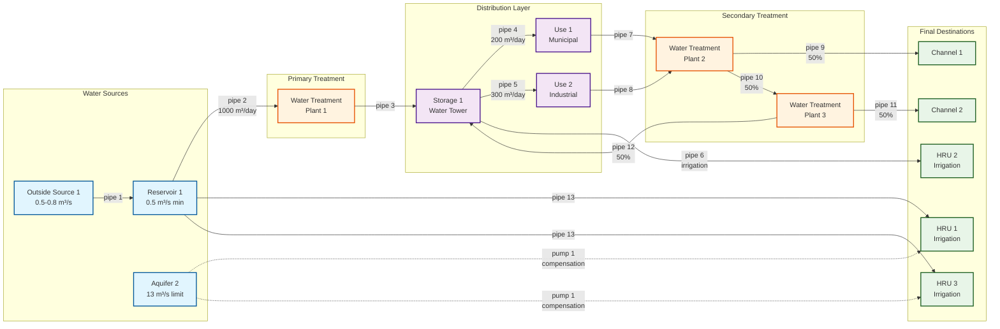

# Water Allocation Process Flowchart

This flowchart represents the water allocation process based on the `water_allocation.wro` file in the `data/solo_1` dataset. The diagram shows the flow from sources (left) through infrastructure (middle) to destinations (right), avoiding line intersections where possible.



## Process Description

This flowchart represents the water allocation system from the `data/solo_1/water_allocation.wro` file. The diagram is organized in left-to-right layers to minimize line crossings and show the logical flow of water through the system.

### Layer 1: Water Sources (Left Side)
1. **Outside Source 1**: External water input with seasonal flow (0.5-0.8 m³/s)
2. **Reservoir 1**: Primary surface water storage with minimum flow constraint (0.5 m³/s)
3. **Aquifer 2**: Groundwater source with extraction limit (13 m³/s)

### Layer 2: Primary Treatment
1. **Water Treatment Plant 1**: Initial water processing receiving 1000 m³/day from reservoir

### Layer 3: Distribution Infrastructure
1. **Storage 1**: Water tower providing system pressure and storage buffer
2. **Use 1**: Municipal water consumption (200 m³/day, 70% of storage output)
3. **Use 2**: Industrial water consumption (300 m³/day, 30% of storage output)

### Layer 4: Secondary Treatment
1. **Water Treatment Plant 2**: Processes return flows from municipal and industrial uses
2. **Water Treatment Plant 3**: Final treatment stage receiving 50% of WTP2 output

### Layer 5: Final Destinations (Right Side)
1. **Channel 1**: Surface water body receiving 50% of WTP2 output
2. **Channel 2**: Surface water body receiving 50% of WTP3 output  
3. **HRU 1-3**: Hydrologic Response Units for agricultural irrigation

### Key System Features

#### Water Rights and Allocation
- **Rule Type**: "high_right_first_serve" - prioritizes senior water rights
- **Transfer Objects**: 14 different water transfer/allocation rules

#### Infrastructure Components
- **Pipes**: 13 conveyance pipes with specific flow rates and fractions
- **Pump**: 1 groundwater pump for irrigation compensation
- **Treatment Plants**: 3 water treatment facilities
- **Storage**: 1 water tower for pressure and buffering

#### Compensation System
- Aquifer can supplement reservoir water for HRU irrigation (dashed lines)
- Activated when primary sources cannot meet demand
- Uses pump system for groundwater extraction

#### Flow Management
- **Transfer Types**: 
  - `outflow`: Pass-through with no demand constraint
  - `ave_day`: Fixed daily volume transfers (200-1000 m³/day)
  - `dtbl_irr`: Dynamic irrigation based on decision tables
- **Recycling**: WTP3 can return water to Storage 1 (pipe 12)
- **Load Balancing**: Multiple 50% splits for efficient distribution

#### Demand Characteristics
- Municipal/Industrial: Fixed daily demands
- Irrigation: Variable based on crop water requirements using decision table "irr_str8_dmd"
- Seasonal Variations: Outside source has different limits by month

### Viewing Instructions

To view this flowchart:
1. Copy the Mermaid code to any Mermaid-compatible viewer
2. Use online tools like mermaid.live or GitHub's built-in Mermaid rendering
3. Integrate into documentation systems that support Mermaid diagrams

### Alternative ASCII Flowchart

For environments without Mermaid support, here's a simplified ASCII representation:

```
SOURCES        PRIMARY         DISTRIBUTION      SECONDARY        DESTINATIONS
               TREATMENT                         TREATMENT

┌─────────────┐     ┌─────┐     ┌─────────────┐     ┌─────┐     ┌──────────────┐
│Outside Src 1│────▶│WTP 1│────▶│  Storage 1  │     │WTP 2│────▶│  Channel 1   │
└─────────────┘     └─────┘     └─────────────┘     └─────┘     └──────────────┘
       │                              │               ▲               │
       ▼                              ▼               │               ▼
┌─────────────┐                 ┌──────────┐          │         ┌──────────────┐
│Reservoir 1  │                 │  Use 1   │─────────▶│         │  Channel 2   │
└─────────────┘                 └──────────┘                    └──────────────┘
       │                              │                               ▲
       │                              ▼                               │
       │                        ┌──────────┐     ┌─────┐              │
       │                        │  Use 2   │────▶│WTP 3│─────────────▶│
       │                        └──────────┘     └─────┘              │
       │                              │               │               │
       │                              ▼               ▼               │
       │                        ┌──────────┐     ┌─────────────┐      │
       │                        │  HRU 2   │     │ (recycle to │      │
       │                        └──────────┘     │ Storage 1)  │      │
       │                                         └─────────────┘      │
       ├────────────────────────────────────────────────────────────▶│
       │                   ┌──────────┐                               │
       └──────────────────▶│  HRU 1   │                               │
                           └──────────┘                               │
┌─────────────┐                  ▲                                    │
│ Aquifer 2   │                  │                                    │
│(Pump 1)     │..................│ (compensation)                     │
└─────────────┘                  ▼                                    │
       │                   ┌──────────┐                               │
       └───(compensation)──▶│  HRU 3   │                               │
                           └──────────┘                               │
                                                                      │
Legend:                                                               │
────▶  Primary flow (pipes)                                          │
.....▶ Compensation flow (pump)                                      │
▼▲     Flow direction                                                 │
```

### Key Flow Paths

1. **Main Municipal Path**: Outside Source → Reservoir → WTP1 → Storage → Uses → WTP2 → Channels
2. **Irrigation Path**: Storage → HRU2 (direct) | Reservoir → HRU1,3 (with aquifer backup)
3. **Treatment Recycling**: WTP3 can return treated water to Storage
4. **Compensation System**: Aquifer supplements irrigation when reservoir is limited

### Data Source Reference

This diagram is based on:
- File: `data/solo_1/water_allocation.wro`
- Water allocation object: "07080209"
- Rule type: "high_right_first_serve"
- Total components: 3 sources, 14 transfers, 3 WTPs, 2 uses, 1 storage, 13 pipes, 1 pump