# Water Allocation Process Flowchart

This flowchart represents the water allocation process based on the `water_allocation.wro` file in the `data/solo_1` dataset. The diagram shows the flow from sources (left) through infrastructure (middle) to destinations (right), avoiding line intersections where possible.

```mermaid
graph LR
    %% Layer 1: Sources
    subgraph Sources["Water Sources"]
        OSRC1[Outside Source 1<br/>0.5-0.8 m³/s]
        RES1[Reservoir 1<br/>0.5 m³/s min]
        AQU2[Aquifer 2<br/>13 m³/s limit]
    end

    %% Layer 2: Primary Treatment  
    subgraph Treatment1["Primary Treatment"]
        WTP1[Water Treatment<br/>Plant 1]
    end
    
    %% Layer 3: Storage and Distribution
    subgraph Distribution["Distribution Layer"]
        STOR1[Storage 1<br/>Water Tower]
        USE1[Use 1<br/>Municipal]
        USE2[Use 2<br/>Industrial]
    end
    
    %% Layer 4: Secondary Treatment
    subgraph Treatment2["Secondary Treatment"]
        WTP2[Water Treatment<br/>Plant 2]
        WTP3[Water Treatment<br/>Plant 3]
    end
    
    %% Layer 5: Final Destinations
    subgraph Destinations["Final Destinations"]
        CHA1[Channel 1]
        CHA2[Channel 2]
        HRU1[HRU 1<br/>Irrigation]
        HRU2[HRU 2<br/>Irrigation]  
        HRU3[HRU 3<br/>Irrigation]
    end

    %% Transfer connections based on water_allocation.wro
    %% TRN_NUM 1: osrc 1 → res 1 via pipe 1
    OSRC1 -->|"TRN 1: pipe 1<br/>osrc1→res1<br/>outflow"| RES1
    
    %% TRN_NUM 2: res 1 → wtp 1 via pipe 2
    RES1 -->|"TRN 2: pipe 2<br/>res1→wtp1<br/>1000 m³/day"| WTP1
    
    %% TRN_NUM 3: wtp 1 → stor 1 via pipe 3
    WTP1 -->|"TRN 3: pipe 3<br/>wtp1→stor1<br/>outflow"| STOR1
    
    %% TRN_NUM 4: stor 1 → use 1 via pipe 4
    STOR1 -->|"TRN 4: pipe 4<br/>stor1→use1<br/>200 m³/day (70%)"| USE1
    
    %% TRN_NUM 5: stor 1 → use 2 via pipe 5
    STOR1 -->|"TRN 5: pipe 5<br/>stor1→use2<br/>300 m³/day (30%)"| USE2
    
    %% TRN_NUM 6: stor 1 → hru 2 via pipe 6
    STOR1 -->|"TRN 6: pipe 6<br/>stor1→hru2<br/>irrigation demand"| HRU2
    
    %% TRN_NUM 7: use 1 → wtp 2 via pipe 7
    USE1 -->|"TRN 7: pipe 7<br/>use1→wtp2<br/>outflow"| WTP2
    
    %% TRN_NUM 8: use 2 → wtp 2 via pipe 8
    USE2 -->|"TRN 8: pipe 8<br/>use2→wtp2<br/>outflow"| WTP2
    
    %% TRN_NUM 9: wtp 2 → cha 1 via pipe 9
    WTP2 -->|"TRN 9: pipe 9<br/>wtp2→cha1<br/>outflow (50%)"| CHA1
    
    %% TRN_NUM 10: wtp 2 → wtp 3 via pipe 10
    WTP2 -->|"TRN 10: pipe 10<br/>wtp2→wtp3<br/>outflow (50%)"| WTP3
    
    %% TRN_NUM 11: wtp 3 → cha 2 via pipe 11
    WTP3 -->|"TRN 11: pipe 11<br/>wtp3→cha2<br/>outflow (50%)"| CHA2
    
    %% TRN_NUM 12: wtp 3 → stor 1 via pipe 12 (recycle)
    WTP3 -->|"TRN 12: pipe 12<br/>wtp3→stor1<br/>outflow (50%) RECYCLE"| STOR1
    
    %% TRN_NUM 13: res 1 + aqu 2 → hru 3 via pipe 13 + pump 1
    RES1 -->|"TRN 13: pipe 13<br/>res1→hru3<br/>irrigation demand"| HRU3
    AQU2 -.->|"TRN 13: pump 1<br/>aqu2→hru3<br/>compensation"| HRU3
    
    %% TRN_NUM 14: res 1 + aqu 2 → hru 1 via pipe 13 + pump 1
    RES1 -->|"TRN 14: pipe 13<br/>res1→hru1<br/>irrigation demand"| HRU1
    AQU2 -.->|"TRN 14: pump 1<br/>aqu2→hru1<br/>compensation"| HRU1

    %% Styling
    classDef sourceClass fill:#e1f5fe,stroke:#01579b,stroke-width:2px
    classDef treatmentClass fill:#fff3e0,stroke:#e65100,stroke-width:2px
    classDef distribClass fill:#f3e5f5,stroke:#4a148c,stroke-width:2px
    classDef destClass fill:#e8f5e8,stroke:#1b5e20,stroke-width:2px
    
    class OSRC1,RES1,AQU2 sourceClass
    class WTP1,WTP2,WTP3 treatmentClass
    class STOR1,USE1,USE2 distribClass
    class CHA1,CHA2,HRU1,HRU2,HRU3 destClass
```



## Process Description

This flowchart represents the water allocation system from the `data/solo_1/water_allocation.wro` file. The diagram shows all 14 transfer connections with explicit pipe and pump routing information, organized in left-to-right layers to minimize line crossings.

### Water Transfer Connections

The following table shows each transfer (TRN_NUM) with its source, conveyance, and destination:

| Transfer | Type | Amount | Source Object | Pipe/Pump | Destination | Flow Description |
|----------|------|--------|---------------|-----------|-------------|------------------|
| TRN 1 | outflow | - | osrc 1 | pipe 1 | res 1 | Outside source to reservoir |
| TRN 2 | ave_day | 1000 m³/day | res 1 | pipe 2 | wtp 1 | Reservoir to treatment plant |
| TRN 3 | outflow | - | wtp 1 | pipe 3 | stor 1 | Treatment plant to storage |
| TRN 4 | ave_day | 200 m³/day | stor 1 | pipe 4 | use 1 | Storage to municipal use (70%) |
| TRN 5 | ave_day | 300 m³/day | stor 1 | pipe 5 | use 2 | Storage to industrial use (30%) |
| TRN 6 | dtbl_irr | demand | stor 1 | pipe 6 | hru 2 | Storage to irrigation |
| TRN 7 | outflow | - | use 1 | pipe 7 | wtp 2 | Municipal use to secondary treatment |
| TRN 8 | outflow | - | use 2 | pipe 8 | wtp 2 | Industrial use to secondary treatment |
| TRN 9 | outflow | - | wtp 2 | pipe 9 | cha 1 | Secondary treatment to channel (50%) |
| TRN 10 | outflow | - | wtp 2 | pipe 10 | wtp 3 | Secondary to tertiary treatment (50%) |
| TRN 11 | outflow | - | wtp 3 | pipe 11 | cha 2 | Tertiary treatment to channel (50%) |
| TRN 12 | outflow | - | wtp 3 | pipe 12 | stor 1 | **RECYCLE**: Tertiary treatment back to storage (50%) |
| TRN 13 | dtbl_irr | demand | res 1 + aqu 2 | pipe 13 + pump 1 | hru 3 | Reservoir + aquifer compensation to irrigation |
| TRN 14 | dtbl_irr | demand | res 1 + aqu 2 | pipe 13 + pump 1 | hru 1 | Reservoir + aquifer compensation to irrigation |

### Layer 1: Water Sources (Left Side)
1. **Outside Source 1**: External water input with seasonal flow (0.5-0.8 m³/s)
2. **Reservoir 1**: Primary surface water storage with minimum flow constraint (0.5 m³/s)
3. **Aquifer 2**: Groundwater source with extraction limit (13 m³/s)

### Layer 2: Primary Treatment
1. **Water Treatment Plant 1**: Initial water processing receiving 1000 m³/day from reservoir

### Layer 3: Distribution Infrastructure
1. **Storage 1**: Water tower providing system pressure and storage buffer
2. **Use 1**: Municipal water consumption (200 m³/day, 70% of storage output)
3. **Use 2**: Industrial water consumption (300 m³/day, 30% of storage output)

### Layer 4: Secondary Treatment
1. **Water Treatment Plant 2**: Processes return flows from municipal and industrial uses
2. **Water Treatment Plant 3**: Final treatment stage receiving 50% of WTP2 output

### Layer 5: Final Destinations (Right Side)
1. **Channel 1**: Surface water body receiving 50% of WTP2 output
2. **Channel 2**: Surface water body receiving 50% of WTP3 output  
3. **HRU 1-3**: Hydrologic Response Units for agricultural irrigation

### Key System Features

#### Water Rights and Allocation
- **Rule Type**: "high_right_first_serve" - prioritizes senior water rights
- **Transfer Objects**: 14 different water transfer/allocation rules

#### Infrastructure Components
- **Pipes**: 13 conveyance pipes with specific flow rates and fractions
- **Pump**: 1 groundwater pump for irrigation compensation
- **Treatment Plants**: 3 water treatment facilities
- **Storage**: 1 water tower for pressure and buffering

#### Compensation System
- Aquifer can supplement reservoir water for HRU irrigation (dashed lines)
- Activated when primary sources cannot meet demand
- Uses pump system for groundwater extraction

#### Flow Management
- **Transfer Types**: 
  - `outflow`: Pass-through with no demand constraint
  - `ave_day`: Fixed daily volume transfers (200-1000 m³/day)
  - `dtbl_irr`: Dynamic irrigation based on decision tables
- **Recycling**: WTP3 can return water to Storage 1 (pipe 12)
- **Load Balancing**: Multiple 50% splits for efficient distribution

#### Demand Characteristics
- Municipal/Industrial: Fixed daily demands
- Irrigation: Variable based on crop water requirements using decision table "irr_str8_dmd"
- Seasonal Variations: Outside source has different limits by month

### Viewing Instructions

To view this flowchart:
1. Copy the Mermaid code to any Mermaid-compatible viewer
2. Use online tools like mermaid.live or GitHub's built-in Mermaid rendering
3. Integrate into documentation systems that support Mermaid diagrams

### Alternative ASCII Flowchart

For environments without Mermaid support, here's a simplified ASCII representation showing transfer numbers:

```
SOURCES        PRIMARY         DISTRIBUTION      SECONDARY        DESTINATIONS
               TREATMENT                         TREATMENT

┌─────────────┐  TRN2 ┌─────┐  TRN3 ┌─────────────┐     ┌─────┐  TRN9 ┌──────────────┐
│Outside Src 1│──────▶│WTP 1│──────▶│  Storage 1  │     │WTP 2│──────▶│  Channel 1   │
└─────────────┘       └─────┘       └─────────────┘     └─────┘       └──────────────┘
    │TRN1                              │TRN4,5,6       ▲TRN7,8            │
    ▼                                  ▼               │               TRN10▼
┌─────────────┐                 ┌──────────┐          │         ┌──────────────┐
│Reservoir 1  │                 │Use1 & Use2│─────────▶│         │    WTP 3     │
└─────────────┘                 └──────────┘                    └──────────────┘
    │TRN13,14                         │TRN6                       │TRN11    │TRN12
    │                                 ▼                          ▼         ▼
    │                           ┌──────────┐               ┌──────────────┐ │
    │                           │  HRU 2   │               │  Channel 2   │ │
    │                           └──────────┘               └──────────────┘ │
    │                                                                       │
    ├──────pipe13─────────────────────────────────────────────────────────▶│
    │                     ┌──────────┐                                      │
    └────pipe13──────────▶│  HRU 1   │                                      │
                          └──────────┘                                      │
┌─────────────┐                ▲                                            │
│ Aquifer 2   │                │                                            │
│   (Pump 1)  │................│ (compensation TRN13,14)                    │
└─────────────┘                ▼                                            │
    │                    ┌──────────┐                                       │
    └───pump1(comp)─────▶│  HRU 3   │                         (RECYCLE)────┘
                         └──────────┘                         

Transfer Numbers (TRN):
TRN1:  osrc1→res1     TRN8:  use2→wtp2     
TRN2:  res1→wtp1      TRN9:  wtp2→cha1
TRN3:  wtp1→stor1     TRN10: wtp2→wtp3
TRN4:  stor1→use1     TRN11: wtp3→cha2
TRN5:  stor1→use2     TRN12: wtp3→stor1 (RECYCLE)
TRN6:  stor1→hru2     TRN13: res1+aqu2→hru3
TRN7:  use1→wtp2      TRN14: res1+aqu2→hru1
```

### Key Flow Paths

1. **Main Municipal Path**: Outside Source → Reservoir → WTP1 → Storage → Uses → WTP2 → Channels
2. **Irrigation Path**: Storage → HRU2 (direct) | Reservoir → HRU1,3 (with aquifer backup)
3. **Treatment Recycling**: WTP3 can return treated water to Storage
4. **Compensation System**: Aquifer supplements irrigation when reservoir is limited

### Data Source Reference

This diagram is based on:
- File: `data/solo_1/water_allocation.wro`
- Water allocation object: "07080209"
- Rule type: "high_right_first_serve"
- Total components: 3 sources, 14 transfers, 3 WTPs, 2 uses, 1 storage, 13 pipes, 1 pump