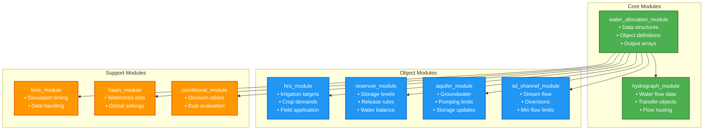

# SWAT+ Water Allocation Subroutine Hierarchy

## Detailed Call Tree with Line Numbers

```mermaid
graph TD
    subgraph "🚀 PROGRAM STARTUP & INITIALIZATION"
        MAIN[Main Program] --> INIT[Initialization Phase]
        INIT --> PROC_OPEN["📊 proc_open()<br/>📍 Called from: Main Program"]
        PROC_OPEN --> HEADER["📊 header_water_allocation()<br/>📍 Called from: proc_open(), Line 17<br/>📄 Actions:<br/>• Open water_allo_day.txt/csv<br/>• Open water_allo_mon.txt/csv<br/>• Open water_allo_yr.txt/csv<br/>• Open water_allo_aa.txt/csv<br/>• Write file headers"]
        
        INIT --> READ_PHASE[Input Processing Phase]
        READ_PHASE --> READ_WA["📖 water_allocation_read()<br/>📍 Called from: Input processing<br/>📄 Actions:<br/>• Read .wal allocation files<br/>• Parse source objects<br/>• Parse demand objects<br/>• Setup allocation rules<br/>• Allocate output arrays"]
    end
    
    subgraph "🔄 DAILY SIMULATION LOOP"
        MAIN --> TIMELOOP["⏱️ time_control()<br/>📍 Called from: Main Program<br/>🔄 Daily time stepping loop"]
        TIMELOOP --> WALLO_DAILY_CHECK{Water Allocation Objects<br/>with cha_ob == 'n'?}
        
        WALLO_DAILY_CHECK -->|Yes| WALLO_DIRECT["🎯 wallo_control(iwallo)<br/>📍 Called from: time_control(), Line 239<br/>📝 Context: Non-channel water allocation objects<br/>🔢 Variable: j = iwallo (compiler warning fix)"]
        
        TIMELOOP --> COMMAND_PHASE["📋 command()<br/>📍 Called from: time_control(), Line 250<br/>📝 Comment: '!! command loop'"]
        COMMAND_PHASE --> OBJ_LOOP[Object Processing Loop]
        OBJ_LOOP --> SD_CHANNEL_CHECK{Object Type ==<br/>'channel'?}
        
        SD_CHANNEL_CHECK -->|Yes| SD_CHANNEL_CALL["🌊 sd_channel_control3()<br/>📍 Called from: command(), Line 362<br/>📝 Context: Channel flow processing"]
        
        SD_CHANNEL_CALL --> WALLO_CHANNEL_CHECK{sd_ch(isdch)%wallo > 0?}
        WALLO_CHANNEL_CHECK -->|Yes| WALLO_CHANNEL["🎯 wallo_control(sd_ch%wallo)<br/>📍 Called from: sd_channel_control3(), Line 395<br/>📝 Comment: '!! check decision table for water allocation'<br/>📝 Context: Channel-based water allocation"]
        
        %% Main wallo_control internal processes
        WALLO_DIRECT --> WALLO_INTERNAL
        WALLO_CHANNEL --> WALLO_INTERNAL
        
        WALLO_INTERNAL["🎯 wallo_control() - INTERNAL PROCESSES<br/>📋 Local Variables:<br/>• itrn: demand object number<br/>• isrc: source object number<br/>• j: hru number"]
        
        WALLO_INTERNAL --> ZERO_TOTALS["🔄 Initialize Arrays<br/>Line 29: wallo(iwallo)%tot = walloz<br/>Line 36: wallod_out(iwallo)%trn(itrn)%src(isrc) = walloz"]
        
        ZERO_TOTALS --> OUTSIDE_SRC[Process Outside Sources<br/>Lines 40-49: osrc flow calculation]
        
        OUTSIDE_SRC --> DEMAND_CALL["💧 wallo_demand(iwallo, itrn, isrc)<br/>📍 Called from: wallo_control(), Line 52<br/>📝 Purpose: Set demand for each object"]
        
        DEMAND_CALL --> DEMAND_CHECK{wallod_out%trn_flo > 0?}
        DEMAND_CHECK -->|Yes| INIT_WITHDRAW["🔄 Initialize Withdrawal<br/>Line 58: wdraw_om_tot = hz"]
        
        INIT_WITHDRAW --> WITHDRAW_LOOP[Source Loop: isrc = 1 to src_num]
        WITHDRAW_LOOP --> WITHDRAW_CHECK{trn_m3 > 1.e-6?}
        WITHDRAW_CHECK -->|Yes| WITHDRAW_CALL["🏗️ wallo_withdraw(iwallo, itrn, isrc)<br/>📍 Called from: wallo_control(), Line 62<br/>📝 Purpose: Extract water from sources<br/>🔢 Global Variable: trn_m3 = wallod_out%src%demand"]
        
        WITHDRAW_CALL --> COMP_LOOP[Compensation Loop: Check compensation sources]
        COMP_LOOP --> COMP_CHECK{wallo%trn%src%comp == 'y'?}
        COMP_CHECK -->|Yes| COMP_WITHDRAW["🏗️ wallo_withdraw(iwallo, itrn, isrc)<br/>📍 Called from: wallo_control(), Line 71<br/>📝 Purpose: Compensation withdrawal for unmet demand<br/>🔢 Global Variable: trn_m3 = wallo%trn%unmet_m3"]
        
        COMP_WITHDRAW --> CALC_TOTAL[Calculate Total Withdrawal<br/>Lines 77-81: Sum from all sources]
        COMP_CHECK -->|No| CALC_TOTAL
        
        CALC_TOTAL --> TRANSFER_CALL["🚰 wallo_transfer(iwallo, itrn)<br/>📍 Called from: wallo_control(), Line 85<br/>📝 Purpose: Transfer water to receiving object"]
        
        TRANSFER_CALL --> APPLY_WATER[Apply Water to Receivers<br/>Lines 88-150: Receiver type processing]
        
        APPLY_WATER --> TREATMENT_CHECK{Receiver Type == 'wtp'?}
        TREATMENT_CHECK -->|Yes| TREATMENT_CALL["🧪 wallo_treatment(iwallo, j)<br/>📍 Called from: wallo_control(), Line 133<br/>📝 Context: Within 'wtp' case block<br/>📝 Purpose: Wastewater treatment processing"]
        
        TREATMENT_CHECK -->|No| SUM_TOTALS[Sum Totals<br/>Lines 159-162: Accumulate object totals]
        TREATMENT_CALL --> SUM_TOTALS
        
        SUM_TOTALS --> NEXT_DEMAND[Next Demand Object Loop]
        NEXT_DEMAND --> MORE_DEMANDS{More Demand Objects?}
        MORE_DEMANDS -->|Yes| DEMAND_CALL
        MORE_DEMANDS -->|No| RETURN_WALLO[Return from wallo_control]
    end
    
    subgraph "📈 OUTPUT PROCESSING"
        COMMAND_PHASE --> TIME_CHECK{time%yrs > pco%nyskip?}
        TIME_CHECK -->|Yes| OUTPUT_LOOP[Water Allocation Output Loop]
        OUTPUT_LOOP --> OUTPUT_CALL["📈 water_allocation_output(iwro)<br/>📍 Called from: command(), Line 427<br/>📝 Context: Within time check block<br/>📋 Loop: iwro = 1 to db_mx%wallo_db<br/>📝 Purpose: Generate all output reports"]
        
        OUTPUT_CALL --> OUTPUT_FREQ{Output Frequency Check}
        OUTPUT_FREQ --> DAILY_OUT["📄 Daily Output<br/>pco%water_allo%d == 'y'<br/>Files: water_allo_day.txt/csv"]
        OUTPUT_FREQ --> MONTHLY_OUT["📄 Monthly Output<br/>pco%water_allo%m == 'y'<br/>Files: water_allo_mon.txt/csv"]
        OUTPUT_FREQ --> YEARLY_OUT["📄 Yearly Output<br/>pco%water_allo%y == 'y'<br/>Files: water_allo_yr.txt/csv"]
        OUTPUT_FREQ --> AA_OUT["📄 Average Annual<br/>pco%water_allo%a == 'y'<br/>Files: water_allo_aa.txt/csv"]
    end
    
    DEMAND_CHECK -->|No| SUM_TOTALS
    WITHDRAW_CHECK -->|No| COMP_LOOP
    WALLO_CHANNEL_CHECK -->|No| OBJ_LOOP
    SD_CHANNEL_CHECK -->|No| OBJ_LOOP
    WALLO_DAILY_CHECK -->|No| COMMAND_PHASE
    TIME_CHECK -->|No| END_DAY
    
    END_DAY --> NEXT_DAY{More Simulation Days?}
    NEXT_DAY -->|Yes| TIMELOOP
    NEXT_DAY -->|No| END_SIM([End Simulation])
    
    classDef startup fill:#E3F2FD,stroke:#1976D2,stroke-width:2px
    classDef mainloop fill:#F3E5F5,stroke:#7B1FA2,stroke-width:2px
    classDef subroutine fill:#E8F5E8,stroke:#388E3C,stroke-width:3px
    classDef decision fill:#FFF3E0,stroke:#F57C00,stroke-width:2px
    classDef process fill:#FAFAFA,stroke:#616161,stroke-width:1px
    classDef internal fill:#E0F2F1,stroke:#00695C,stroke-width:2px
    
    class MAIN,INIT,READ_PHASE startup
    class TIMELOOP,COMMAND_PHASE,OBJ_LOOP,WITHDRAW_LOOP,COMP_LOOP,OUTPUT_LOOP mainloop
    class PROC_OPEN,HEADER,READ_WA,WALLO_DIRECT,WALLO_CHANNEL,SD_CHANNEL_CALL,DEMAND_CALL,WITHDRAW_CALL,COMP_WITHDRAW,TRANSFER_CALL,TREATMENT_CALL,OUTPUT_CALL subroutine
    class WALLO_DAILY_CHECK,SD_CHANNEL_CHECK,WALLO_CHANNEL_CHECK,DEMAND_CHECK,WITHDRAW_CHECK,COMP_CHECK,TREATMENT_CHECK,TIME_CHECK,OUTPUT_FREQ,NEXT_DAY decision
    class ZERO_TOTALS,OUTSIDE_SRC,INIT_WITHDRAW,CALC_TOTAL,APPLY_WATER,SUM_TOTALS internal
```

## Detailed Call Sequence with File and Line References

```
Main Program
├── Initialization Phase
│   ├── proc_open()                           ← Called from Main Program
│   │   └── header_water_allocation()         ← Called from proc_open.f90, Line 17
│   │       ├── Open water_allo_day.txt/csv   ← File handles 3110, 3114
│   │       ├── Open water_allo_mon.txt/csv   ← File handles 3111, 3115  
│   │       ├── Open water_allo_yr.txt/csv    ← File handles 3112, 3116
│   │       └── Open water_allo_aa.txt/csv    ← File handles 3113, 3117
│   │
│   └── Input Processing Phase
│       └── water_allocation_read()           ← Called during input processing
│           ├── Read .wal allocation files    ← File handle 107
│           ├── Parse water source objects    ← Channel, reservoir, aquifer, unlimited
│           ├── Parse water demand objects    ← HRU, municipal, industrial
│           └── Allocate output arrays        ← wallod_out, wallom_out, etc.
│
└── Daily Simulation Loop
    └── time_control()                        ← Called from Main Program
        ├── Direct Water Allocation (Non-Channel Objects)
        │   └── IF wallo(iwallo)%cha_ob == "n"
        │       └── wallo_control(j)          ← Called from time_control.f90, Line 239
        │                                       Variable j = iwallo (compiler warning fix)
        │
        └── Command Processing
            └── command()                     ← Called from time_control.f90, Line 250
                ├── Object Processing Loop
                │   └── IF object type == "channel"
                │       └── sd_channel_control3() ← Called from command.f90, Line 362
                │           └── IF sd_ch(isdch)%wallo > 0
                │               └── wallo_control(sd_ch%wallo) ← Called from sd_channel_control3.f90, Line 395
                │
                └── Output Processing
                    └── IF time%yrs > pco%nyskip
                        └── FOR iwro = 1 to db_mx%wallo_db
                            └── water_allocation_output(iwro) ← Called from command.f90, Line 427

wallo_control() Internal Call Sequence:
├── Initialize Arrays
│   ├── Line 29: wallo(iwallo)%tot = walloz
│   └── Line 36: wallod_out(iwallo)%trn(itrn)%src(isrc) = walloz
│
├── Process Outside Sources (Lines 40-49)
│   └── Calculate osrc_om_out(iosrc)%flo based on limit type
│
├── FOR each demand object (itrn = 1 to wallo%trn_obs)
│   ├── wallo_demand(iwallo, itrn, isrc)      ← Called from wallo_control.f90, Line 52
│   │   ├── Calculate demand by transfer type (outflo, ave_day, rec, dtbl_con, dtbl_lum)
│   │   ├── Set wallod_out(iwallo)%trn(itrn)%trn_flo
│   │   └── Initialize unmet_m3 = total demand
│   │
│   ├── IF wallod_out%trn_flo > 0
│   │   ├── Line 58: wdraw_om_tot = hz (initialize withdrawal)
│   │   │
│   │   ├── Primary Withdrawal Loop (isrc = 1 to src_num)
│   │   │   └── IF trn_m3 > 1.e-6
│   │   │       └── wallo_withdraw(iwallo, itrn, isrc) ← Called from wallo_control.f90, Line 62
│   │   │           ├── Check source type (cha, res, aqu, unl)
│   │   │           ├── Apply source-specific limits and constraints
│   │   │           ├── Update source water balances
│   │   │           └── Record withdrawal and unmet amounts
│   │   │
│   │   ├── Compensation Withdrawal Loop (isrc = 1 to src_num)
│   │   │   └── IF wallo%trn%src%comp == "y" AND unmet_m3 > 1.e-6
│   │   │       └── wallo_withdraw(iwallo, itrn, isrc) ← Called from wallo_control.f90, Line 71
│   │   │
│   │   ├── Calculate Total Withdrawal (Lines 77-81)
│   │   │   └── Sum wallo%trn%withdr_tot from all sources
│   │   │
│   │   ├── wallo_transfer(iwallo, itrn)       ← Called from wallo_control.f90, Line 85
│   │   │   ├── Apply conveyance losses (pipe/pump efficiency)
│   │   │   └── Prepare water for transfer to receiving objects
│   │   │
│   │   └── Apply Water to Receivers (Lines 88-150)
│   │       ├── j = wallo%trn%rcv%num (receiver object number)
│   │       └── SELECT CASE wallo%trn%rcv%typ
│   │           ├── "hru": Apply irrigation (Lines 92-119)
│   │           ├── "res": Add to reservoir storage (Lines 121-123)
│   │           ├── "aqu": Add to aquifer storage (Lines 125-127)
│   │           ├── "wtp": Water treatment processing (Lines 129-133)
│   │           │   └── wallo_treatment(iwallo, j) ← Called from wallo_control.f90, Line 133
│   │           │       ├── Apply treatment efficiency
│   │           │       ├── Update water quality concentrations
│   │           │       └── Calculate treated outflow
│   │           ├── "use": Water use processing (Lines 135-139)
│   │           ├── "stor": Water tower storage (Lines 141-143)
│   │           └── "canal": Canal storage (Lines 145-149)
│   │
│   └── Sum Object Totals (Lines 159-162)
│       ├── wallo%tot%demand += wallod_out%trn%trn_flo
│       ├── wallo%tot%withdr += wallo%trn%withdr_tot
│       └── wallo%tot%unmet += wallo%trn%unmet_m3
│
└── Return from wallo_control (Line 166)

water_allocation_output() Processing:
├── FOR each demand object (idmd = 1 to wallo%dmd_obs)
│   ├── Sum monthly/yearly/average annual outputs
│   ├── Daily Output (IF pco%water_allo%d == "y")
│   │   └── Write to files 3110 (txt) and 3114 (csv)
│   ├── Monthly Output (IF pco%water_allo%m == "y")
│   │   └── Write to files 3111 (txt) and 3115 (csv)
│   ├── Yearly Output (IF pco%water_allo%y == "y")
│   │   └── Write to files 3112 (txt) and 3116 (csv)
│   └── Average Annual Output (IF pco%water_allo%a == "y")
│       └── Write to files 3113 (txt) and 3117 (csv)
└── Return from water_allocation_output
```

## Module Dependencies



## Key Points for New Users

### 🎯 **Main Entry Point**
- `wallo_control()` is the central orchestrator
- Called once per day for each water allocation object
- Coordinates all sub-processes in logical order

### 📚 **Initialization (Once per simulation)**
1. `water_allocation_read()` - Load all configuration
2. `header_water_allocation()` - Prepare output files

### 🔄 **Daily Processing (Every simulation day)**
1. `wallo_demand()` - Calculate water needs
2. `wallo_withdraw()` - Extract available water  
3. `wallo_transfer()` - Move water to users
4. `wallo_treatment()` - Apply treatment (if needed)
5. `water_allocation_output()` - Record results

### 📊 **Data Flow**
- Input files → Module data structures → Processing → Output files
- Water balance tracking throughout all steps
- Constituent and quality tracking parallel to water

### ⚠️ **Important Notes**
- Each subroutine updates global data structures
- Water balance is maintained at each step
- Source limits are enforced during withdrawal
- Treatment is optional based on object configuration
- Output frequency is user-configurable