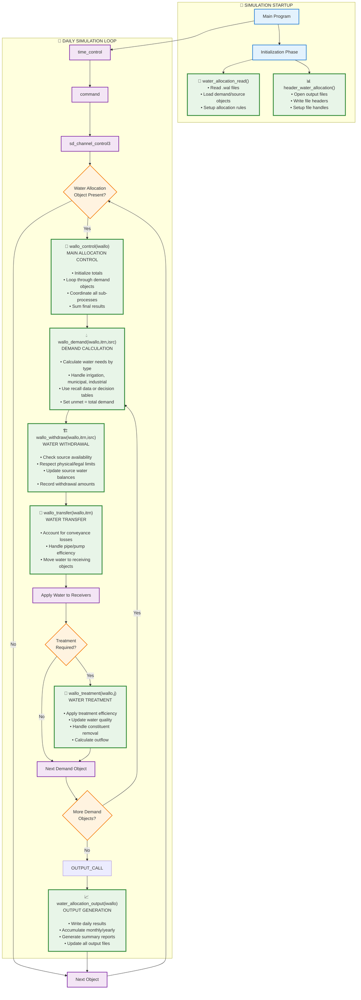
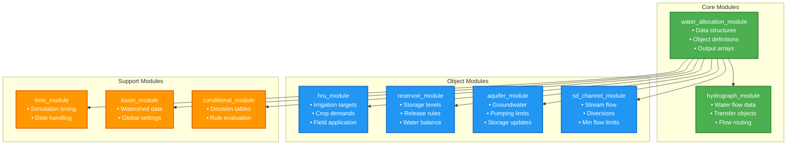

# SWAT+ Water Allocation Subroutine Hierarchy

## Call Tree Diagram



## Simplified Call Sequence

```
Main Program
├── Initialization
│   ├── water_allocation_read()     ← Read input files
│   └── header_water_allocation()   ← Setup outputs
│
└── Daily Loop (time_control)
    └── Command Processing
        └── Channel Processing (sd_channel_control3)
            └── IF water allocation object exists:
                ├── wallo_control(iwallo)           ← MAIN CONTROL
                │   ├── wallo_demand(...)           ← Calculate demands  
                │   ├── wallo_withdraw(...)         ← Extract water
                │   ├── wallo_transfer(...)         ← Move water
                │   └── wallo_treatment(...) [opt]  ← Treat water
                └── water_allocation_output(...)    ← Write results
```

## Module Dependencies



## Key Points for New Users

### 🎯 **Main Entry Point**
- `wallo_control()` is the central orchestrator
- Called once per day for each water allocation object
- Coordinates all sub-processes in logical order

### 📚 **Initialization (Once per simulation)**
1. `water_allocation_read()` - Load all configuration
2. `header_water_allocation()` - Prepare output files

### 🔄 **Daily Processing (Every simulation day)**
1. `wallo_demand()` - Calculate water needs
2. `wallo_withdraw()` - Extract available water  
3. `wallo_transfer()` - Move water to users
4. `wallo_treatment()` - Apply treatment (if needed)
5. `water_allocation_output()` - Record results

### 📊 **Data Flow**
- Input files → Module data structures → Processing → Output files
- Water balance tracking throughout all steps
- Constituent and quality tracking parallel to water

### ⚠️ **Important Notes**
- Each subroutine updates global data structures
- Water balance is maintained at each step
- Source limits are enforced during withdrawal
- Treatment is optional based on object configuration
- Output frequency is user-configurable