# SWAT+ Water Allocation System Flowchart

This flowchart illustrates the complete water allocation process in SWAT+ model, showing the logical order of subroutines, modules, data types, and input/output operations.

## Overview

The water allocation system in SWAT+ manages water transfers between different water sources (channels, reservoirs, aquifers) and demand objects (irrigation, municipal, industrial uses) through a systematic process of demand calculation, availability checking, withdrawal, treatment, and transfer.

## Main Flowchart

```mermaid
flowchart TD
    %% Start and Initialization
    START([Simulation Start]) --> INIT[Initialize Water Allocation System]
    INIT --> READ_INPUT{{"📁 READ INPUT FILES<br/>water_allocation_read()"}}
    
    %% Input Reading Phase
    READ_INPUT --> INPUT_FILES["📄 Input Files:<br/>• Water allocation objects (.wal)<br/>• Demand objects<br/>• Source objects<br/>• Treatment parameters<br/>• Recall data"]
    
    INPUT_FILES --> SETUP_HEADERS{{"📊 SETUP OUTPUT HEADERS<br/>header_water_allocation()"}}
    SETUP_HEADERS --> OUTPUT_SETUP["📄 Output Files Setup:<br/>• water_allo_day.txt/csv<br/>• water_allo_mon.txt/csv<br/>• water_allo_yr.txt/csv<br/>• water_allo_aa.txt/csv"]
    
    OUTPUT_SETUP --> DAILY_LOOP{Daily Simulation Loop}
    
    %% Main Daily Processing
    DAILY_LOOP --> CHANNEL_PROC["🌊 Channel Processing<br/>(sd_channel_control3)"]
    CHANNEL_PROC --> CHECK_WALLO{Water Allocation<br/>Object Present?}
    
    CHECK_WALLO -->|Yes| WALLO_CONTROL{{"🎯 MAIN CONTROL<br/>wallo_control(iwallo)"}}
    CHECK_WALLO -->|No| NEXT_OBJ[Next Object]
    
    %% Main Water Allocation Control Process
    WALLO_CONTROL --> INIT_TOTALS["🔄 Initialize Totals<br/>Zero demand, withdrawal, unmet"]
    
    INIT_TOTALS --> DEMAND_LOOP{For Each Demand Object}
    
    %% Demand Processing Loop
    DEMAND_LOOP --> ZERO_SOURCES["🔄 Zero Source Values<br/>Initialize source arrays"]
    ZERO_SOURCES --> OUTSIDE_SOURCES["🌐 Compute Outside Sources<br/>Process external inflows"]
    
    OUTSIDE_SOURCES --> CALC_DEMAND{{"💧 CALCULATE DEMAND<br/>wallo_demand(iwallo, itrn, isrc)"}}
    
    %% Demand Calculation Details
    CALC_DEMAND --> DEMAND_TYPE{Demand Type?}
    DEMAND_TYPE -->|"outflo"| OUTFLOW_DEMAND["External Source Outflow"]
    DEMAND_TYPE -->|"ave_day"| DAILY_AVG["Average Daily Transfer<br/>m³/day = m³/s × 86400"]
    DEMAND_TYPE -->|"rec"| RECALL_DEMAND["📊 Recall Object<br/>Daily/Monthly/Annual data"]
    DEMAND_TYPE -->|"dtbl_con"| DECISION_TABLE["📋 Decision Table<br/>Conditional transfer"]
    DEMAND_TYPE -->|"dtbl_lum"| IRRIGATION_DEMAND["🌾 HRU Irrigation<br/>Based on crop demand"]
    
    OUTFLOW_DEMAND --> DEMAND_COMPUTED
    DAILY_AVG --> DEMAND_COMPUTED
    RECALL_DEMAND --> DEMAND_COMPUTED
    DECISION_TABLE --> DEMAND_COMPUTED
    IRRIGATION_DEMAND --> DEMAND_COMPUTED
    
    DEMAND_COMPUTED["✅ Demand Computed<br/>Set unmet = total demand"] --> CHECK_DEMAND{Demand > 0?}
    
    CHECK_DEMAND -->|No| SUM_TOTALS
    CHECK_DEMAND -->|Yes| WITHDRAW_LOOP{For Each Source}
    
    %% Withdrawal Processing Loop
    WITHDRAW_LOOP --> WITHDRAW_CHECK{Source Demand > 0?}
    WITHDRAW_CHECK -->|Yes| WALLO_WITHDRAW{{"🏗️ WITHDRAW WATER<br/>wallo_withdraw(iwallo, itrn, isrc)"}}
    WITHDRAW_CHECK -->|No| NEXT_SOURCE[Next Source]
    
    %% Withdrawal Details by Source Type
    WALLO_WITHDRAW --> SOURCE_TYPE{Source Type?}
    
    SOURCE_TYPE -->|"cha"| CHANNEL_SOURCE["🌊 CHANNEL SOURCE<br/>• Check minimum flow limit<br/>• Calculate available diversion<br/>• Update channel hydrograph<br/>• Apply withdrawal ratio"]
    
    SOURCE_TYPE -->|"res"| RESERVOIR_SOURCE["🏞️ RESERVOIR SOURCE<br/>• Check minimum level limit<br/>• Calculate available volume<br/>• Update reservoir storage<br/>• Apply withdrawal ratio"]
    
    SOURCE_TYPE -->|"aqu"| AQUIFER_SOURCE["💧 AQUIFER SOURCE<br/>• Check depth limits<br/>• Calculate available water<br/>• Update groundwater storage<br/>• Handle gwflow integration"]
    
    SOURCE_TYPE -->|"unl"| UNLIMITED_SOURCE["♾️ UNLIMITED SOURCE<br/>• No limits applied<br/>• Full demand satisfied"]
    
    CHANNEL_SOURCE --> UPDATE_WITHDRAWAL
    RESERVOIR_SOURCE --> UPDATE_WITHDRAWAL
    AQUIFER_SOURCE --> UPDATE_WITHDRAWAL
    UNLIMITED_SOURCE --> UPDATE_WITHDRAWAL
    
    UPDATE_WITHDRAWAL["📊 Update Withdrawal Records<br/>• Record withdrawal amount<br/>• Update unmet demand<br/>• Accumulate source totals"] --> NEXT_SOURCE
    
    NEXT_SOURCE --> COMPENSATION_LOOP{Check Compensation<br/>Sources}
    
    %% Compensation Loop
    COMPENSATION_LOOP --> COMP_ALLOWED{Compensation<br/>Allowed?}
    COMP_ALLOWED -->|Yes| COMP_WITHDRAW["🔄 Additional Withdrawal<br/>Try to meet unmet demand"]
    COMP_ALLOWED -->|No| CALC_TOTAL_WITHDRAW
    COMP_WITHDRAW --> CALC_TOTAL_WITHDRAW
    
    CALC_TOTAL_WITHDRAW["📊 Calculate Total Withdrawal<br/>Sum from all sources"] --> TRANSFER_WATER{{"🚰 TRANSFER WATER<br/>wallo_transfer(iwallo, itrn)"}}
    
    %% Transfer Processing
    TRANSFER_WATER --> CONV_TYPE{Conveyance Type?}
    CONV_TYPE -->|"pipe"| PIPE_LOSSES["🚰 Pipe Losses<br/>Apply loss fraction"]
    CONV_TYPE -->|"pump"| PUMP_LOSSES["⚡ Pump Losses<br/>Apply pump efficiency"]
    
    PIPE_LOSSES --> APPLY_WATER
    PUMP_LOSSES --> APPLY_WATER
    
    APPLY_WATER["💦 Apply Water to Receiver"] --> RECEIVER_TYPE{Receiver Type?}
    
    %% Receiver Types
    RECEIVER_TYPE -->|"hru"| HRU_IRRIGATION["🌾 HRU IRRIGATION<br/>• Convert m³ to mm<br/>• Apply irrigation efficiency<br/>• Calculate runoff<br/>• Update soil water<br/>• Salt/constituent accounting"]
    
    RECEIVER_TYPE -->|"res"| RES_TRANSFER["🏞️ RESERVOIR TRANSFER<br/>• Add to reservoir storage<br/>• Update water balance"]
    
    RECEIVER_TYPE -->|"aqu"| AQU_TRANSFER["💧 AQUIFER TRANSFER<br/>• Add to aquifer storage<br/>• Update groundwater balance"]
    
    RECEIVER_TYPE -->|"wtp"| WTP_TREATMENT{{"🏭 WATER TREATMENT<br/>wallo_treatment(iwallo, j)"}}
    
    RECEIVER_TYPE -->|"use"| WATER_USE["🏢 WATER USE<br/>• Municipal<br/>• Industrial<br/>• Commercial"]
    
    RECEIVER_TYPE -->|"stor"| STORAGE["🏪 WATER STORAGE<br/>• Water tower<br/>• Tank storage"]
    
    RECEIVER_TYPE -->|"canal"| CANAL["🚰 CANAL<br/>• Conveyance losses<br/>• Evaporation<br/>• Seepage"]
    
    %% Treatment Process
    WTP_TREATMENT --> TREATMENT_PROCESS["🧪 Treatment Process<br/>• Apply treatment efficiency<br/>• Update concentrations<br/>• Convert conc to mass<br/>• Handle constituents"]
    
    HRU_IRRIGATION --> SUM_TOTALS
    RES_TRANSFER --> SUM_TOTALS
    AQU_TRANSFER --> SUM_TOTALS
    TREATMENT_PROCESS --> SUM_TOTALS
    WATER_USE --> SUM_TOTALS
    STORAGE --> SUM_TOTALS
    CANAL --> SUM_TOTALS
    
    %% Summation and Output
    SUM_TOTALS["📊 Sum Object Totals<br/>• Total demand<br/>• Total withdrawal<br/>• Total unmet"] --> NEXT_DEMAND[Next Demand Object]
    
    NEXT_DEMAND --> MORE_DEMANDS{More Demand<br/>Objects?}
    MORE_DEMANDS -->|Yes| DEMAND_LOOP
    MORE_DEMANDS -->|No| OUTPUT_RESULTS{{"📈 OUTPUT RESULTS<br/>water_allocation_output(iwallo)"}}
    
    %% Output Processing
    OUTPUT_RESULTS --> OUTPUT_TYPE{Output Frequency?}
    OUTPUT_TYPE -->|Daily| DAILY_OUTPUT["📄 Daily Output<br/>water_allo_day.txt/csv"]
    OUTPUT_TYPE -->|Monthly| MONTHLY_OUTPUT["📄 Monthly Output<br/>water_allo_mon.txt/csv"]
    OUTPUT_TYPE -->|Yearly| YEARLY_OUTPUT["📄 Yearly Output<br/>water_allo_yr.txt/csv"]
    OUTPUT_TYPE -->|Average Annual| AA_OUTPUT["📄 Average Annual Output<br/>water_allo_aa.txt/csv"]
    
    DAILY_OUTPUT --> NEXT_OBJ
    MONTHLY_OUTPUT --> NEXT_OBJ
    YEARLY_OUTPUT --> NEXT_OBJ
    AA_OUTPUT --> NEXT_OBJ
    
    NEXT_OBJ --> MORE_OBJECTS{More Water Allocation<br/>Objects?}
    MORE_OBJECTS -->|Yes| WALLO_CONTROL
    MORE_OBJECTS -->|No| NEXT_DAY[Next Simulation Day]
    
    NEXT_DAY --> DAILY_LOOP
    DAILY_LOOP -->|Simulation Complete| END([End])
    
    %% Styling
    classDef inputOutput fill:#e1f5fe,stroke:#01579b,stroke-width:2px
    classDef process fill:#f3e5f5,stroke:#4a148c,stroke-width:2px
    classDef decision fill:#fff3e0,stroke:#e65100,stroke-width:2px
    classDef subroutine fill:#e8f5e8,stroke:#1b5e20,stroke-width:3px
    classDef data fill:#fce4ec,stroke:#880e4f,stroke-width:2px
    
    class READ_INPUT,SETUP_HEADERS,OUTPUT_RESULTS,DAILY_OUTPUT,MONTHLY_OUTPUT,YEARLY_OUTPUT,AA_OUTPUT inputOutput
    class WALLO_CONTROL,CALC_DEMAND,WALLO_WITHDRAW,TRANSFER_WATER,WTP_TREATMENT subroutine
    class CHECK_WALLO,CHECK_DEMAND,SOURCE_TYPE,RECEIVER_TYPE,OUTPUT_TYPE decision
    class INPUT_FILES,OUTPUT_SETUP,DEMAND_COMPUTED,UPDATE_WITHDRAWAL data
```



## Key Modules and Data Types

### Core Modules
- **`water_allocation_module`**: Central module containing all water allocation data structures
- **`hydrograph_module`**: Handles water flow hydrographs and water transfer objects
- **`hru_module`**: HRU (Hydrologic Response Unit) management for irrigation
- **`reservoir_module`**: Reservoir operations and water balance
- **`aquifer_module`**: Groundwater management and aquifer operations
- **`sd_channel_module`**: Stream/channel flow routing

### Key Data Types
- **`water_allocation`**: Main allocation object containing sources, demands, and rules
- **`water_source_objects`**: Defines available water sources (channels, reservoirs, aquifers)
- **`water_demand_objects`**: Defines water demands (irrigation, municipal, industrial)
- **`hyd_output`**: Hydrograph data structure for water, nutrients, and constituents
- **`source_output`**: Output tracking for demand, withdrawal, and unmet values

## Subroutine Call Hierarchy

```
Main Simulation Loop (time_control)
├── Channel Processing (sd_channel_control3)
│   └── wallo_control(iwallo) ──────────── [MAIN CONTROL]
│       ├── wallo_demand(iwallo, itrn, isrc) ── [DEMAND CALCULATION]
│       ├── wallo_withdraw(iwallo, itrn, isrc) ─ [WATER WITHDRAWAL]
│       ├── wallo_transfer(iwallo, itrn) ────── [WATER TRANSFER]
│       ├── wallo_treatment(iwallo, j) ──────── [WATER TREATMENT]
│       └── wallo_use(iwallo, j) ──────────── [WATER USE]
└── Command Processing (command)
    └── water_allocation_output(iwallo) ────── [OUTPUT WRITING]

Initialization Phase:
├── water_allocation_read() ──────────────── [INPUT READING]
└── header_water_allocation() ─────────────── [OUTPUT SETUP]
```

## Input/Output Operations

### Input Files Read
1. **Water Allocation Objects** (.wal files)
   - Allocation rules and parameters
   - Source and demand object definitions
   - Transfer rules and priorities

2. **Recall Data**
   - Time series data for water demands
   - Historical flow data

3. **Decision Tables**
   - Conditional water allocation rules
   - Trigger conditions and responses

### Output Files Written
1. **Daily Output** (`water_allo_day.txt/csv`)
   - Daily water allocation results
   - Demand, withdrawal, and unmet values

2. **Monthly Output** (`water_allo_mon.txt/csv`)
   - Monthly aggregated results
   - Source and demand summaries

3. **Yearly Output** (`water_allo_yr.txt/csv`)
   - Annual water allocation summaries
   - Long-term trend analysis

4. **Average Annual Output** (`water_allo_aa.txt/csv`)
   - Multi-year average results
   - Statistical summaries

## Process Flow Summary

1. **Initialization**: Read input files and setup output headers
2. **Daily Loop**: For each simulation day:
   - Process each water allocation object
   - Calculate demands based on type (irrigation, municipal, etc.)
   - Check source availability (channels, reservoirs, aquifers)
   - Withdraw water within limits and rights
   - Apply treatment if required
   - Transfer water to receiving objects
   - Update water balances and hydrographs
   - Output results at specified frequencies

This system enables sophisticated water management modeling with multiple sources, competing demands, water rights, and treatment processes integrated into the SWAT+ watershed simulation framework.