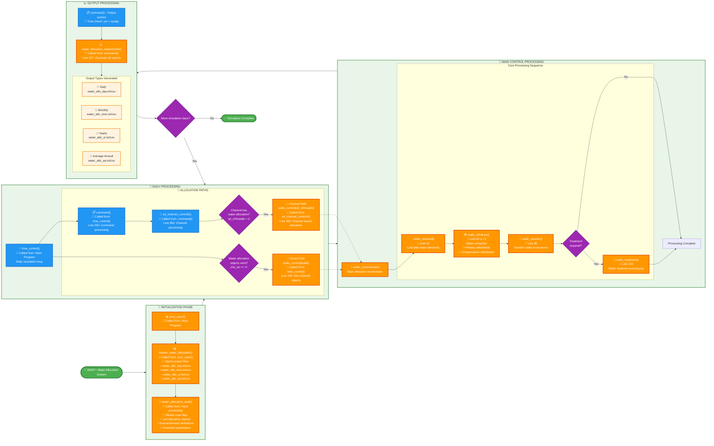

# SWAT+ Water Allocation System - Poster Flowchart

This document provides **two layout options** for the water allocation flowchart optimized for different poster presentation needs. Both versions include detailed call stack information with file references and line numbers.

## 🖼️ Landscape Flowchart (Left-to-Right)

This is a **landscape (left-to-right) layout** optimized for wide poster formats. The horizontal design makes better use of poster space and provides clear visual flow from initialization through daily processing to output generation.

## 📊 Top-Down Flowchart (Portrait)

This is a **top-down (portrait) layout** suitable for traditional poster formats or when vertical space is preferred. This layout provides a more linear sequential flow from top to bottom.

```mermaid
flowchart TD
    %% Title and Start
    START([🚀 SWAT+ Water Allocation System]) --> INIT_SETUP
    
    %% Initialization Phase with Call Stack
    INIT_SETUP["📁 INITIALIZATION PHASE"]
    INIT_SETUP --> PROC_OPEN["📊 proc_open()<br/>📍 Called from: Main Program"]
    PROC_OPEN --> HEADER_CALL["📊 header_water_allocation()<br/>📍 Called from: proc_open()<br/>📄 Opens output files:<br/>• water_allo_day.txt/csv<br/>• water_allo_mon.txt/csv<br/>• water_allo_yr.txt/csv<br/>• water_allo_aa.txt/csv"]
    
    %% Note: water_allocation_read is called elsewhere in input processing
    HEADER_CALL --> READ_NOTE["📖 water_allocation_read()<br/>📍 Called from: Input processing<br/>📄 Reads input files:<br/>• .wal allocation objects<br/>• Source/demand definitions<br/>• Treatment parameters"]
    
    READ_NOTE --> TIME_LOOP
    
    %% Daily Simulation Loop with Call Stack
    TIME_LOOP["🔄 time_control()<br/>📍 Called from: Main Program<br/>Daily simulation loop"]
    
    TIME_LOOP --> WALLO_CHECK1{Water allocation<br/>objects exist?<br/>cha_ob == 'n'}
    WALLO_CHECK1 -->|Yes| DIRECT_CALL["🎯 wallo_control(iwallo)<br/>📍 Called from: time_control()<br/>Line 239: Direct call for non-channel objects"]
    
    TIME_LOOP --> COMMAND_CALL["📋 command()<br/>📍 Called from: time_control()<br/>Line 250: Command processing loop"]
    COMMAND_CALL --> SD_CHANNEL["🌊 sd_channel_control3()<br/>📍 Called from: command()<br/>Line 362: Channel processing"]
    
    SD_CHANNEL --> WALLO_CHECK2{Channel has<br/>water allocation?<br/>sd_ch%wallo > 0}
    WALLO_CHECK2 -->|Yes| CHANNEL_CALL["🎯 wallo_control(sd_ch%wallo)<br/>📍 Called from: sd_channel_control3()<br/>Line 395: Channel-based allocation"]
    
    %% Main Control Process with Internal Calls
    DIRECT_CALL --> MAIN_CONTROL
    CHANNEL_CALL --> MAIN_CONTROL
    MAIN_CONTROL["🎯 MAIN CONTROL SUBROUTINE<br/>wallo_control(iwallo)<br/><br/>Internal call sequence:"]
    
    MAIN_CONTROL --> DEMAND_CALC["💧 wallo_demand(iwallo, itrn, isrc)<br/>📍 Called from: wallo_control()<br/>Line 52: Calculate water demands"]
    
    DEMAND_CALC --> WATER_WITHDRAW["🏗️ wallo_withdraw(iwallo, itrn, isrc)<br/>📍 Called from: wallo_control()<br/>Line 62 & 71: Water extraction<br/>• Line 62: Primary withdrawal<br/>• Line 71: Compensation withdrawal"]
    
    WATER_WITHDRAW --> WATER_TRANSFER["🚰 wallo_transfer(iwallo, itrn)<br/>📍 Called from: wallo_control()<br/>Line 85: Transfer water to receivers"]
    
    WATER_TRANSFER --> TREATMENT_CHECK{Treatment<br/>required?}
    TREATMENT_CHECK -->|Yes| TREATMENT["🧪 wallo_treatment(iwallo, j)<br/>📍 Called from: wallo_control()<br/>Line 133: Water treatment processing"]
    TREATMENT_CHECK -->|No| OUTPUT_CHECK
    TREATMENT --> OUTPUT_CHECK
    
    %% Output Phase with Call Stack
    OUTPUT_CHECK --> COMMAND_OUTPUT["📋 command() - Output section<br/>📍 Time check: yrs > nyskip"]
    COMMAND_OUTPUT --> OUTPUT_CALL["📈 water_allocation_output(iwallo)<br/>📍 Called from: command()<br/>Line 427: Generate all reports"]
    
    OUTPUT_CALL --> NEXT_DAY
    
    %% Loop Control
    NEXT_DAY{More simulation days?}
    NEXT_DAY -->|Yes| TIME_LOOP
    NEXT_DAY -->|No| END
    
    END([✅ Simulation Complete])
    
    %% Styling for poster clarity
    classDef startEnd fill:#4CAF50,stroke:#2E7D32,stroke-width:3px,color:#fff
    classDef process fill:#2196F3,stroke:#1565C0,stroke-width:2px,color:#fff
    classDef subroutine fill:#FF9800,stroke:#E65100,stroke-width:3px,color:#fff
    classDef decision fill:#9C27B0,stroke:#6A1B9A,stroke-width:2px,color:#fff
    classDef callstack fill:#E8F5E8,stroke:#2E7D32,stroke-width:2px
    
    class START,END startEnd
    class TIME_LOOP,COMMAND_CALL,SD_CHANNEL,COMMAND_OUTPUT process
    class PROC_OPEN,HEADER_CALL,READ_NOTE,DIRECT_CALL,CHANNEL_CALL,MAIN_CONTROL,DEMAND_CALC,WATER_WITHDRAW,WATER_TRANSFER,TREATMENT,OUTPUT_CALL subroutine
    class WALLO_CHECK1,WALLO_CHECK2,TREATMENT_CHECK,NEXT_DAY decision
```

## Key Information for Poster

### 🖼️ **Layout Options**

**Landscape Layout (Left-to-Right):**
- **Best for:** Wide poster formats, conference displays, landscape orientation
- **Benefits:** Natural reading pattern, better space utilization for wide formats
- **Features:** Phase-based subgraphs, horizontal flow, optimized for landscape posters

**Top-Down Layout (Portrait):**
- **Best for:** Traditional poster formats, portrait orientation, vertical displays
- **Benefits:** Linear sequential flow, familiar top-to-bottom reading pattern
- **Features:** Vertical flow, compact design, suitable for standard poster dimensions

### 🔧 Main Subroutines (Detailed Call Stack)

**Initialization Sequence:**
1. **Main Program** → **`proc_open()`** → **`header_water_allocation()`**
   - Sets up output file headers and opens files
2. **Input Processing** → **`water_allocation_read()`**
   - Reads .wal files and allocation configurations

**Daily Processing Sequence:**
3. **Main Program** → **`time_control()`** 
   - Line 239: **`wallo_control(iwallo)`** *(for non-channel objects)*
   - Line 250: **`command()`** → Line 362: **`sd_channel_control3()`** → Line 395: **`wallo_control()`** *(for channel objects)*

**Within wallo_control() - Internal Call Sequence:**
4. **`wallo_control()`** → Line 52: **`wallo_demand(iwallo, itrn, isrc)`**
5. **`wallo_control()`** → Line 62 & 71: **`wallo_withdraw(iwallo, itrn, isrc)`**
6. **`wallo_control()`** → Line 85: **`wallo_transfer(iwallo, itrn)`**
7. **`wallo_control()`** → Line 133: **`wallo_treatment(iwallo, j)`** *(if needed)*

**Output Generation:**
8. **`command()`** → Line 427: **`water_allocation_output(iwallo)`**

### 📦 Key Modules & Types
- **`water_allocation_module`** - Core data structures
- **`hydrograph_module`** - Water flow management
- **`water_allocation`** - Main allocation object type
- **`water_source_objects`** - Source definitions
- **`water_demand_objects`** - Demand definitions

### 📊 Input/Output Summary

**Inputs Read:**
- 📁 Water allocation files (.wal)
- 📁 Recall data (time series)
- 📁 Decision tables (conditional rules)

**Outputs Written:**
- 📄 `water_allo_day.txt/csv` - Daily results
- 📄 `water_allo_mon.txt/csv` - Monthly summaries  
- 📄 `water_allo_yr.txt/csv` - Annual totals
- 📄 `water_allo_aa.txt/csv` - Average annual

### 🌊 Water Sources Supported
- **Channels** - Stream/river diversions with minimum flow constraints
- **Reservoirs** - Storage releases with level restrictions
- **Aquifers** - Groundwater pumping with depth limits
- **Unlimited** - External sources without limits

### 💧 Demand Types Handled
- **Irrigation** - Crop water requirements (HRU-based)
- **Municipal** - Urban water supply (fixed/variable)
- **Industrial** - Manufacturing water needs
- **Inter-basin** - Water transfers between watersheds