# SWAT+ Water Allocation System - Poster Flowchart

## Simplified Flowchart for Poster Presentation

This is a streamlined version of the water allocation flowchart designed specifically for poster presentations, highlighting the main process flow and key subroutines.

```mermaid
flowchart TD
    %% Title and Start
    START([🚀 SWAT+ Water Allocation System]) --> INPUT_PHASE
    
    %% Input Phase
    INPUT_PHASE["📁 INITIALIZATION PHASE<br/><br/>📖 water_allocation_read()<br/>• Read .wal files<br/>• Load demands & sources<br/>• Setup allocation rules<br/><br/>📊 header_water_allocation()<br/>• Create output files<br/>• Setup file headers"]
    
    INPUT_PHASE --> SIMULATION_LOOP
    
    %% Main Simulation
    SIMULATION_LOOP["🔄 DAILY SIMULATION LOOP<br/><br/>For each simulation day:<br/>Process all water allocation objects"]
    
    SIMULATION_LOOP --> MAIN_CONTROL
    
    %% Main Control Process  
    MAIN_CONTROL["🎯 MAIN CONTROL SUBROUTINE<br/><br/>📍 wallo_control(iwallo)<br/><br/>For each water allocation object:<br/>• Initialize totals<br/>• Process demand objects<br/>• Calculate source availability<br/>• Execute transfers<br/>• Update water balances"]
    
    MAIN_CONTROL --> DEMAND_CALC
    
    %% Demand Calculation
    DEMAND_CALC["💧 DEMAND CALCULATION<br/><br/>📍 wallo_demand(iwallo, itrn, isrc)<br/><br/>Calculate water demands by type:<br/>🌾 Irrigation (HRU-based)<br/>🏘️ Municipal (fixed/recall)<br/>🏭 Industrial (decision table)<br/>🚰 Inter-basin transfer"]
    
    DEMAND_CALC --> WATER_WITHDRAW
    
    %% Water Withdrawal
    WATER_WITHDRAW["🏗️ WATER WITHDRAWAL<br/><br/>📍 wallo_withdraw(iwallo, itrn, isrc)<br/><br/>Withdraw from sources:<br/>🌊 Channels (respect min flow)<br/>🏞️ Reservoirs (respect min level)<br/>💧 Aquifers (respect depth limits)<br/>♾️ Unlimited sources"]
    
    WATER_WITHDRAW --> WATER_TRANSFER
    
    %% Water Transfer
    WATER_TRANSFER["🚰 WATER TRANSFER & APPLICATION<br/><br/>📍 wallo_transfer(iwallo, itrn)<br/>• Account for conveyance losses<br/>• Apply to receiving objects<br/><br/>Receiver types:<br/>🌾 HRU irrigation<br/>🏞️ Reservoir storage<br/>💧 Aquifer recharge<br/>🏭 Treatment plants<br/>🏢 Municipal/industrial use"]
    
    WATER_TRANSFER --> TREATMENT
    
    %% Treatment (Optional)
    TREATMENT["🧪 WATER TREATMENT (Optional)<br/><br/>📍 wallo_treatment(iwallo, j)<br/>• Apply treatment efficiency<br/>• Update water quality<br/>• Handle constituent removal<br/>• Calculate treated outflow"]
    
    TREATMENT --> OUTPUT_PHASE
    
    %% Output Phase
    OUTPUT_PHASE["📈 OUTPUT & REPORTING<br/><br/>📍 water_allocation_output(iwallo)<br/><br/>Generate reports:<br/>📄 Daily results<br/>📄 Monthly summaries<br/>📄 Annual totals<br/>📄 Average annual statistics"]
    
    OUTPUT_PHASE --> NEXT_DAY
    
    %% Loop Control
    NEXT_DAY{More simulation days?}
    NEXT_DAY -->|Yes| SIMULATION_LOOP
    NEXT_DAY -->|No| END
    
    END([✅ Simulation Complete])
    
    %% Styling for poster clarity
    classDef startEnd fill:#4CAF50,stroke:#2E7D32,stroke-width:3px,color:#fff
    classDef process fill:#2196F3,stroke:#1565C0,stroke-width:2px,color:#fff
    classDef subroutine fill:#FF9800,stroke:#E65100,stroke-width:3px,color:#fff
    classDef decision fill:#9C27B0,stroke:#6A1B9A,stroke-width:2px,color:#fff
    
    class START,END startEnd
    class INPUT_PHASE,SIMULATION_LOOP,OUTPUT_PHASE process
    class MAIN_CONTROL,DEMAND_CALC,WATER_WITHDRAW,WATER_TRANSFER,TREATMENT subroutine
    class NEXT_DAY decision
```

## Key Information for Poster

### 🔧 Main Subroutines (Call Order)
1. **`water_allocation_read()`** - Read input configuration
2. **`header_water_allocation()`** - Setup output files  
3. **`wallo_control()`** - Main allocation control (daily)
4. **`wallo_demand()`** - Calculate water demands
5. **`wallo_withdraw()`** - Withdraw water from sources
6. **`wallo_transfer()`** - Transfer water to receivers
7. **`wallo_treatment()`** - Optional water treatment
8. **`water_allocation_output()`** - Write results

### 📦 Key Modules & Types
- **`water_allocation_module`** - Core data structures
- **`hydrograph_module`** - Water flow management
- **`water_allocation`** - Main allocation object type
- **`water_source_objects`** - Source definitions
- **`water_demand_objects`** - Demand definitions

### 📊 Input/Output Summary

**Inputs Read:**
- 📁 Water allocation files (.wal)
- 📁 Recall data (time series)
- 📁 Decision tables (conditional rules)

**Outputs Written:**
- 📄 `water_allo_day.txt/csv` - Daily results
- 📄 `water_allo_mon.txt/csv` - Monthly summaries  
- 📄 `water_allo_yr.txt/csv` - Annual totals
- 📄 `water_allo_aa.txt/csv` - Average annual

### 🌊 Water Sources Supported
- **Channels** - Stream/river diversions with minimum flow constraints
- **Reservoirs** - Storage releases with level restrictions
- **Aquifers** - Groundwater pumping with depth limits
- **Unlimited** - External sources without limits

### 💧 Demand Types Handled
- **Irrigation** - Crop water requirements (HRU-based)
- **Municipal** - Urban water supply (fixed/variable)
- **Industrial** - Manufacturing water needs
- **Inter-basin** - Water transfers between watersheds