# SWAT+ Water Allocation System - Poster Flowchart

## Landscape Flowchart for Poster Presentation

This is a **landscape (left-to-right) layout** of the water allocation flowchart optimized for poster presentations. The horizontal design makes better use of poster space and provides clear visual flow from initialization through daily processing to output generation. All subroutines include detailed call stack information with file references and line numbers.

```mermaid
flowchart LR
    %% Start and Initialization Phase
    START([🚀 SWAT+ Water Allocation System]) --> INIT_PHASE
    
    subgraph INIT_PHASE ["📁 INITIALIZATION PHASE"]
        PROC_OPEN["📊 proc_open()<br/>📍 Called from: Main Program"]
        HEADER_CALL["📊 header_water_allocation()<br/>📍 Called from: proc_open()<br/>📄 Opens output files:<br/>• water_allo_day.txt/csv<br/>• water_allo_mon.txt/csv<br/>• water_allo_yr.txt/csv<br/>• water_allo_aa.txt/csv"]
        READ_NOTE["📖 water_allocation_read()<br/>📍 Called from: Input processing<br/>📄 Reads input files:<br/>• .wal allocation objects<br/>• Source/demand definitions<br/>• Treatment parameters"]
        
        PROC_OPEN --> HEADER_CALL
        HEADER_CALL --> READ_NOTE
    end
    
    %% Daily Processing Phase
    INIT_PHASE --> DAILY_PHASE
    
    subgraph DAILY_PHASE ["🔄 DAILY PROCESSING"]
        TIME_LOOP["🔄 time_control()<br/>📍 Called from: Main Program<br/>Daily simulation loop"]
        
        subgraph ALLOCATION_PATHS ["🎯 ALLOCATION PATHS"]
            WALLO_CHECK1{Water allocation<br/>objects exist?<br/>cha_ob == 'n'}
            DIRECT_CALL["🎯 Direct Path<br/>wallo_control(iwallo)<br/>📍 Called from: time_control()<br/>Line 239: Non-channel objects"]
            
            COMMAND_CALL["📋 command()<br/>📍 Called from: time_control()<br/>Line 250: Command processing"]
            SD_CHANNEL["🌊 sd_channel_control3()<br/>📍 Called from: command()<br/>Line 362: Channel processing"]
            WALLO_CHECK2{Channel has<br/>water allocation?<br/>sd_ch%wallo > 0}
            CHANNEL_CALL["🎯 Channel Path<br/>wallo_control(sd_ch%wallo)<br/>📍 Called from: sd_channel_control3()<br/>Line 395: Channel-based allocation"]
        end
        
        TIME_LOOP --> WALLO_CHECK1
        WALLO_CHECK1 -->|Yes| DIRECT_CALL
        TIME_LOOP --> COMMAND_CALL
        COMMAND_CALL --> SD_CHANNEL
        SD_CHANNEL --> WALLO_CHECK2
        WALLO_CHECK2 -->|Yes| CHANNEL_CALL
    end
    
    %% Main Processing Phase
    DAILY_PHASE --> MAIN_PHASE
    
    subgraph MAIN_PHASE ["🎯 MAIN CONTROL PROCESSING"]
        MAIN_CONTROL["🎯 wallo_control(iwallo)<br/>Main allocation orchestrator"]
        
        subgraph CORE_SEQUENCE ["Core Processing Sequence"]
            DEMAND_CALC["💧 wallo_demand()<br/>📍 Line 52<br/>Calculate water demands"]
            WATER_WITHDRAW["🏗️ wallo_withdraw()<br/>📍 Line 62 & 71<br/>Water extraction<br/>• Primary withdrawal<br/>• Compensation withdrawal"]
            WATER_TRANSFER["🚰 wallo_transfer()<br/>📍 Line 85<br/>Transfer water to receivers"]
            TREATMENT_CHECK{Treatment<br/>required?}
            TREATMENT["🧪 wallo_treatment()<br/>📍 Line 133<br/>Water treatment processing"]
        end
        
        MAIN_CONTROL --> DEMAND_CALC
        DEMAND_CALC --> WATER_WITHDRAW
        WATER_WITHDRAW --> WATER_TRANSFER
        WATER_TRANSFER --> TREATMENT_CHECK
        TREATMENT_CHECK -->|Yes| TREATMENT
        TREATMENT_CHECK -->|No| PROCESSING_COMPLETE
        TREATMENT --> PROCESSING_COMPLETE[Processing Complete]
    end
    
    %% Output Phase
    MAIN_PHASE --> OUTPUT_PHASE
    
    subgraph OUTPUT_PHASE ["📈 OUTPUT PROCESSING"]
        COMMAND_OUTPUT["📋 command() - Output section<br/>📍 Time check: yrs > nyskip"]
        OUTPUT_CALL["📈 water_allocation_output(iwallo)<br/>📍 Called from: command()<br/>Line 427: Generate all reports"]
        
        subgraph OUTPUT_TYPES ["Output Types Generated"]
            DAILY_OUT["📄 Daily<br/>water_allo_day.txt/csv"]
            MONTHLY_OUT["📄 Monthly<br/>water_allo_mon.txt/csv"]
            YEARLY_OUT["📄 Yearly<br/>water_allo_yr.txt/csv"]
            AA_OUT["📄 Average Annual<br/>water_allo_aa.txt/csv"]
        end
        
        COMMAND_OUTPUT --> OUTPUT_CALL
        OUTPUT_CALL --> OUTPUT_TYPES
    end
    
    %% Loop Control and End
    OUTPUT_PHASE --> LOOP_CONTROL
    LOOP_CONTROL{More simulation days?}
    LOOP_CONTROL -->|Yes| DAILY_PHASE
    LOOP_CONTROL -->|No| END([✅ Simulation Complete])
    
    %% Connect allocation paths to main processing
    DIRECT_CALL -.-> MAIN_CONTROL
    CHANNEL_CALL -.-> MAIN_CONTROL
    
    %% Styling for landscape poster clarity
    classDef startEnd fill:#4CAF50,stroke:#2E7D32,stroke-width:3px,color:#fff
    classDef process fill:#2196F3,stroke:#1565C0,stroke-width:2px,color:#fff
    classDef subroutine fill:#FF9800,stroke:#E65100,stroke-width:3px,color:#fff
    classDef decision fill:#9C27B0,stroke:#6A1B9A,stroke-width:2px,color:#fff
    classDef phase fill:#E8F5E8,stroke:#2E7D32,stroke-width:2px
    classDef output fill:#FFF3E0,stroke:#F57C00,stroke-width:2px
    
    class START,END startEnd
    class TIME_LOOP,COMMAND_CALL,SD_CHANNEL,COMMAND_OUTPUT process
    class PROC_OPEN,HEADER_CALL,READ_NOTE,DIRECT_CALL,CHANNEL_CALL,MAIN_CONTROL,DEMAND_CALC,WATER_WITHDRAW,WATER_TRANSFER,TREATMENT,OUTPUT_CALL subroutine
    class WALLO_CHECK1,WALLO_CHECK2,TREATMENT_CHECK,LOOP_CONTROL decision
    class INIT_PHASE,DAILY_PHASE,MAIN_PHASE,OUTPUT_PHASE phase
    class DAILY_OUT,MONTHLY_OUT,YEARLY_OUT,AA_OUT output
```

## Key Information for Poster

### 🖼️ **Landscape Layout Benefits**
- **Left-to-right flow** matches natural reading pattern
- **Optimized for poster dimensions** (landscape orientation)
- **Phase-based organization** with clear visual groupings
- **Subgraphs** separate different processing phases
- **Better space utilization** for wide poster formats

### 🔧 Main Subroutines (Detailed Call Stack)

**Initialization Sequence:**
1. **Main Program** → **`proc_open()`** → **`header_water_allocation()`**
   - Sets up output file headers and opens files
2. **Input Processing** → **`water_allocation_read()`**
   - Reads .wal files and allocation configurations

**Daily Processing Sequence:**
3. **Main Program** → **`time_control()`** 
   - Line 239: **`wallo_control(iwallo)`** *(for non-channel objects)*
   - Line 250: **`command()`** → Line 362: **`sd_channel_control3()`** → Line 395: **`wallo_control()`** *(for channel objects)*

**Within wallo_control() - Internal Call Sequence:**
4. **`wallo_control()`** → Line 52: **`wallo_demand(iwallo, itrn, isrc)`**
5. **`wallo_control()`** → Line 62 & 71: **`wallo_withdraw(iwallo, itrn, isrc)`**
6. **`wallo_control()`** → Line 85: **`wallo_transfer(iwallo, itrn)`**
7. **`wallo_control()`** → Line 133: **`wallo_treatment(iwallo, j)`** *(if needed)*

**Output Generation:**
8. **`command()`** → Line 427: **`water_allocation_output(iwallo)`**

### 📦 Key Modules & Types
- **`water_allocation_module`** - Core data structures
- **`hydrograph_module`** - Water flow management
- **`water_allocation`** - Main allocation object type
- **`water_source_objects`** - Source definitions
- **`water_demand_objects`** - Demand definitions

### 📊 Input/Output Summary

**Inputs Read:**
- 📁 Water allocation files (.wal)
- 📁 Recall data (time series)
- 📁 Decision tables (conditional rules)

**Outputs Written:**
- 📄 `water_allo_day.txt/csv` - Daily results
- 📄 `water_allo_mon.txt/csv` - Monthly summaries  
- 📄 `water_allo_yr.txt/csv` - Annual totals
- 📄 `water_allo_aa.txt/csv` - Average annual

### 🌊 Water Sources Supported
- **Channels** - Stream/river diversions with minimum flow constraints
- **Reservoirs** - Storage releases with level restrictions
- **Aquifers** - Groundwater pumping with depth limits
- **Unlimited** - External sources without limits

### 💧 Demand Types Handled
- **Irrigation** - Crop water requirements (HRU-based)
- **Municipal** - Urban water supply (fixed/variable)
- **Industrial** - Manufacturing water needs
- **Inter-basin** - Water transfers between watersheds