# SWAT+ Water Allocation System - Visual Guide for New Users

## Compact Poster-Ready Flowchart

```mermaid
graph TB
    subgraph " "
        subgraph "📚 INITIALIZATION (Once per simulation)"
            A1["📖 water_allocation_read()<br/>Load allocation rules<br/>& object definitions"]
            A2["📊 header_water_allocation()<br/>Setup output files<br/>& headers"]
            A1 --> A2
        end
        
        subgraph "🔄 DAILY PROCESSING (Every simulation day)"
            subgraph "🎯 Main Control Loop"
                B1["🎯 wallo_control(iwallo)<br/>Main allocation orchestrator"]
                
                subgraph "💧 Demand Processing"
                    C1["💧 wallo_demand()<br/>Calculate water needs"]
                    C1a["🌾 Irrigation<br/>(crop-based)"]
                    C1b["🏘️ Municipal<br/>(fixed/recall)"]
                    C1c["🏭 Industrial<br/>(decision table)"]
                    C1 --- C1a
                    C1 --- C1b  
                    C1 --- C1c
                end
                
                subgraph "🏗️ Water Withdrawal"
                    D1["🏗️ wallo_withdraw()<br/>Extract from sources"]
                    D1a["🌊 Channels<br/>(min flow limits)"]
                    D1b["🏞️ Reservoirs<br/>(min level limits)"]
                    D1c["💧 Aquifers<br/>(depth limits)"]
                    D1d["♾️ Unlimited<br/>(no limits)"]
                    D1 --- D1a
                    D1 --- D1b
                    D1 --- D1c
                    D1 --- D1d
                end
                
                subgraph "🚰 Water Transfer & Treatment"
                    E1["🚰 wallo_transfer()<br/>Move water to receivers"]
                    E2["🧪 wallo_treatment()<br/>Optional treatment<br/>(if required)"]
                    E1 --> E2
                end
                
                B1 --> C1
                C1 --> D1
                D1 --> E1
            end
        end
        
        subgraph "📈 OUTPUT GENERATION (Various frequencies)"
            F1["📈 water_allocation_output()<br/>Write results to files"]
            F1a["📄 Daily<br/>(.day files)"]
            F1b["📄 Monthly<br/>(.mon files)"]
            F1c["📄 Annual<br/>(.yr files)"]
            F1d["📄 Average<br/>(.aa files)"]
            F1 --- F1a
            F1 --- F1b
            F1 --- F1c
            F1 --- F1d
        end
    end
    
    A2 --> B1
    E2 --> F1
    F1 --> B1
    
    classDef init fill:#E3F2FD,stroke:#1976D2,stroke-width:2px
    classDef daily fill:#F3E5F5,stroke:#7B1FA2,stroke-width:2px
    classDef subroutine fill:#E8F5E8,stroke:#388E3C,stroke-width:2px
    classDef output fill:#FFF3E0,stroke:#F57C00,stroke-width:2px
    classDef detail fill:#FAFAFA,stroke:#616161,stroke-width:1px
    
    class A1,A2 init
    class B1,C1,D1,E1,E2 subroutine
    class F1 output
    class C1a,C1b,C1c,D1a,D1b,D1c,D1d,F1a,F1b,F1c,F1d detail
```

## Data Flow Architecture

## System Overview for New Users

### 🎯 **What is Water Allocation?**
The SWAT+ water allocation system simulates realistic water management by:
- Managing competing water demands (irrigation, municipal, industrial)
- Respecting water rights and source limitations
- Tracking water transfers between system components
- Accounting for treatment and conveyance losses

### 🔧 **How Does It Work?**

1. **Setup Phase** (once):
   - Read configuration files defining sources, demands, and rules
   - Initialize output files for results tracking

2. **Daily Processing** (every day):
   - Calculate water demands for all users
   - Check source availability and constraints
   - Withdraw water within legal/physical limits
   - Transfer water to end users
   - Apply treatment if required
   - Update system water balances

3. **Output Phase** (configurable frequency):
   - Generate detailed reports of allocation results
   - Track unmet demands and system performance

### 📊 **Key Components**

| Component | Function | Examples |
|-----------|----------|----------|
| **Sources** | Where water comes from | Rivers, reservoirs, aquifers |
| **Demands** | Who needs water | Farms, cities, industries |
| **Rules** | How allocation decisions are made | Water rights, priority systems |
| **Transfers** | How water moves | Pipes, canals, pumps |
| **Treatment** | How water quality is managed | Treatment plants, quality standards |

### 🌊 **Supported Water Sources**
- **🌊 Channels**: Stream diversions with environmental flow requirements
- **🏞️ Reservoirs**: Storage releases with level management
- **💧 Aquifers**: Groundwater extraction with sustainability limits
- **♾️ Unlimited**: External sources (imports, desalination)

### 💧 **Demand Types**
- **🌾 Irrigation**: Crop water needs based on growth stage and weather
- **🏘️ Municipal**: Urban water supply for domestic use
- **🏭 Industrial**: Manufacturing and processing water needs
- **🚰 Transfer**: Moving water between basins or systems

### 📈 **Output Information**
- **Demand**: How much water was requested
- **Withdrawal**: How much water was actually taken
- **Unmet**: How much demand couldn't be satisfied
- **Sources**: Which sources provided water
- **Efficiency**: How well the system performed

This system enables SWAT+ to model complex water management scenarios including drought response, water rights conflicts, and infrastructure planning.